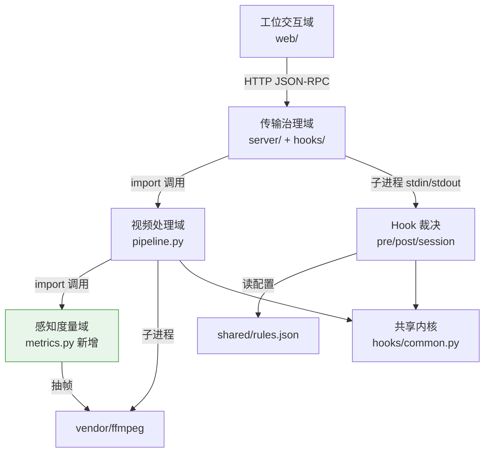
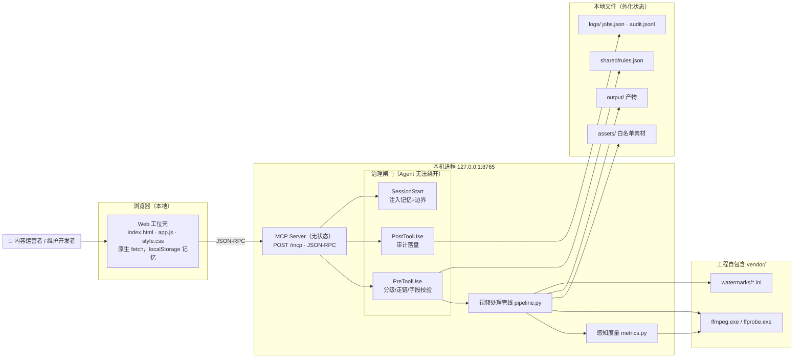
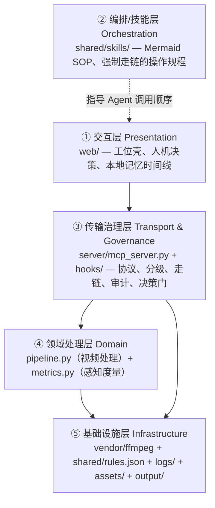
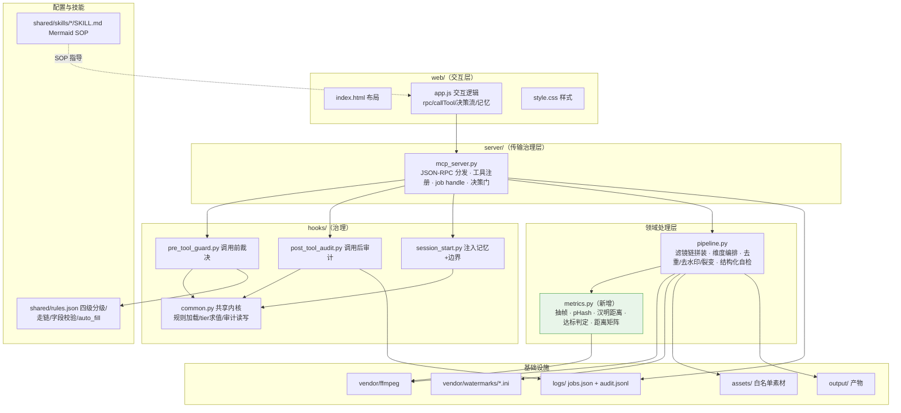
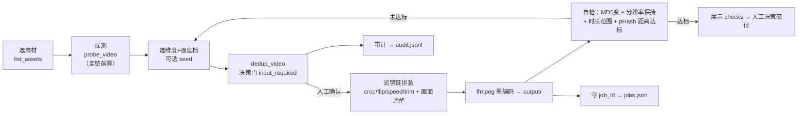
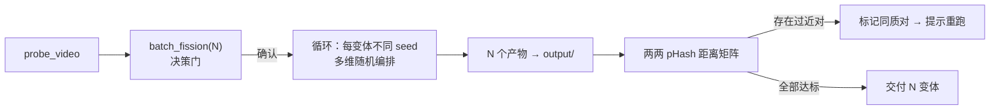
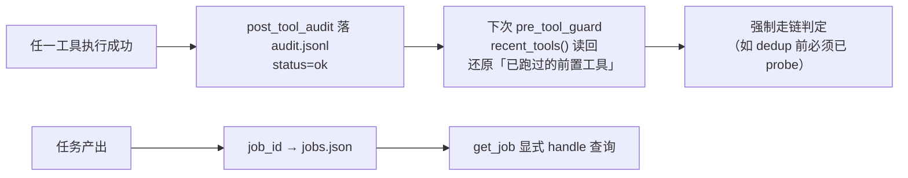
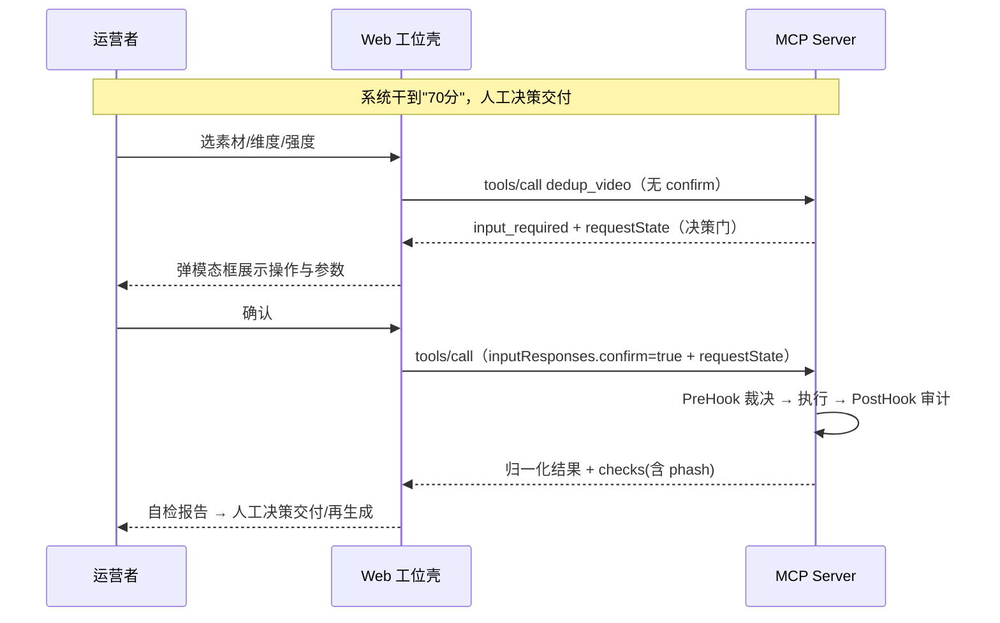

# 01 · 系统总体架构设计（SAD, System Architecture Design）

> ⚠️ **P0 冻结**（2026-08-10）：本文档为架构基线，P0 阶段起冻结，不再原地修改。后续扩展应通过对应 DD Addendum 表述架构影响面。
>
> 视频去重工位 station · 去重维度补齐迭代（第 2 版）
>
> **文档定位**：本文档为顶层架构参考，只回答「系统如何组成」，不下探到 Controller / API / 表 / 类 / 时序 / 代码级实现（这些属于 [video-uniqueness-DD-v1.1](video-uniqueness-DD-v1.1.md)）。
> **业务唯一依据**：[../01-需求分析/02-PRD.md](../01-需求分析/02-PRD.md)。本文不新增、删除或修改任何需求。
> **技术栈说明**：本项目为**本地单用户桌面工具**，实际技术栈为 **Python 3 标准库（http.server）+ 原生 JavaScript + ffmpeg（vendor 自包含）**，**无数据库、无远程账户、无 Cookie 会话**。全文安全/性能/部署设计均按此真实栈诚实展开，不套用 Web 全栈（Hono/Prisma/Better Auth 等）模板。

---

## 1. 项目概述

### 1.1 项目性质

视频去重工位 station 是一个**已上线并端到端验证跑通的本地 MVP**，本期（第 2 版）为**在既有架构上补齐去重维度的迭代**，非从零立项。

- **一句话定位**：一条素材，可编程批量产出「MD5 与视频特征充分互异、观感不崩」的多平台分发变体。
- **运行形态**：本地 Windows，浏览器打开 Web 工位壳，后端为本机 `127.0.0.1:8765` 的无状态 MCP Server，底层调用工程内自包含的 ffmpeg。
- **智能内核**：本产品的「智能」= **随机参数编排 + ffmpeg 滤镜链拼装 + 感知哈希效果自检**，为确定性算法，**不引入生成式大模型**（PRD §10）。

### 1.2 本期迭代范围（P0）

| 增量项 | 内容 | 归属域 |
|---|---|---|
| 裁剪 crop | 按比例裁切并缩放回原分辨率（构图类），三档 2%/5%/8% | 视频处理域 |
| 翻转 flip | 水平/垂直/90°（构图类），默认关闭 | 视频处理域 |
| 变速 speed | `setpts`+`atempo` 音视频同步变速（保音调），三档 ±3%/±5%/±10% + 最短时长保护 | 视频处理域 |
| 去头尾 trim | 裁首尾若干秒（时序类），三档 + 最短时长保护 | 视频处理域 |
| 感知哈希自检 | pHash 逐帧汉明距离度量（平均 ≥12 且最小 ≥8 达标） | 感知度量域（新增） |
| 维度编排 | `dedup_video` 支持维度开关/强度档，seed 控制随机 | 视频处理域 |
| rules 分级 | 新增/扩展工具补四级分级 + 走链 + 字段校验 | 传输治理域 |
| Web UI | 暴露维度勾选/强度档，展示含 phash 的自检结果 | 工位交互域 |

### 1.3 边界（本期不做 / 永久排除）

- **P1 延后**：加水印/文本叠加、背景音/BGM、抽帧。
- **P2 延后**：宫格分屏、动态缩放（Ken Burns）。
- **永久排除**：画中画、加头尾片头片尾/边框、背景虚化等**纯视频编辑功能**（与去重目标无关，PRD §7）。

---

## 2. 逻辑架构先行：限界上下文与依赖方向（阶段 A）

> 依据 monorepo-paradigm skill 的硬性规则：先划清限界上下文、确认依赖方向为有向无环图（DAG），再谈物理组织。本项目为**单一可部署单元**（本地工具），故按决策树落到「单项目结构」，但仍以限界上下文思想约束模块边界，防止依赖纠缠。

### 2.1 限界上下文清单

| 上下文 | 业务边界（只回答「负责什么」） | 对外契约 |
|---|---|---|
| **工位交互域** Web Station | 人机接力界面：选材、探测、选维度/强度、发起处理、展示自检、人工决策交付/再生成、本地记忆 | 通过 HTTP/JSON-RPC 调 MCP，只消费归一化结果 |
| **传输治理域** Transport & Governance | MCP 无状态协议、请求路由、四级安全分级、强制走链、字段校验、人工决策门、审计落盘 | tools/list 契约 + tools/call 契约 + hook stdin/stdout 契约 |
| **视频处理域** Video Processing | ffmpeg 滤镜链拼装、去重维度（画面/构图/时序）、参数随机编排、任务产出、结构化自检 | 纯函数式处理接口（输入素材+参数 → 产出+checks） |
| **感知度量域** Perceptual Metrics（新增） | 抽帧、逐帧 pHash、汉明距离、达标判定、裂变两两距离矩阵 | 度量接口（输入两视频/一组视频 → 距离数值+是否达标） |
| **共享内核** Shared Kernel | 无业务语义的技术工具：路径锚定、规则加载、审计读写、tier 条件求值 | 被上层调用，**不反向依赖任何业务域** |

### 2.2 依赖方向图（DAG，已自查无环）



**依赖规则（严格单向，不允许出现环）**：

```
✅ web            → server          （壳依赖后端，仅走 HTTP 契约）
✅ server         → pipeline / hooks （传输层编排处理与治理）
✅ pipeline       → metrics / vendor （处理域依赖度量与 ffmpeg）
✅ metrics        → vendor           （度量域抽帧依赖 ffmpeg）
✅ 任意业务域      → 共享内核          （允许向下依赖零语义工具）
❌ 共享内核        → 任意业务域        （禁止反向）
❌ pipeline        → server           （禁止处理域回依赖传输层）
❌ metrics         → pipeline         （禁止度量域回依赖，保持可独立测试）
```

自查结论：图中任意两节点无双向可达路径，**无环，满足高可用前提**（PRD 的无状态承诺同向）。

### 2.3 三个高可用硬条件的落地承诺

- **单向依赖**：见 2.2，模块只向下引用，度量域/处理域可独立单测。
- **网络契约通信**：前后端唯一通道是 `127.0.0.1:8765/mcp` 的 JSON-RPC，前端不触碰后端内部实现。
- **无状态化**：MCP Server 遵循 2026-07-28 无状态规范，无 initialize 握手、无 Session-Id；应用状态（任务 handle、走链前置、记忆）全部外化到 `logs/`（jobs.json / audit.jsonl），任一进程可读，实例可随时替换。

---

## 3. 总体架构



**关键架构特征**：

1. **强制走链的独占道闸**：所有工具调用只能经 `tools/call` 路径，PreToolUse Hook 是唯一裁决点，Agent 无法绕开分级/走链/字段校验。
2. **人工决策门内置于协议**：warned/blocked 工具首次调用返回 `input_required`（SEP-2322），必须携带 `inputResponses.confirm=true` 二次调用才真执行——决策权保留在人手中。
3. **自包含无外网**：ffmpeg 同捆 `vendor/`，素材/产物/日志全在工程内，`__file__` 相对锚定 + 环境变量覆盖，整体移动零改动。

---

## 4. 技术架构

### 4.1 技术选型与决策依据（在多个方案中为什么选这个，代价是什么）

| 层 | 选型 | 候选方案 | 为什么选它 | 代价 / 权衡 |
|---|---|---|---|---|
| 传输 | Python 标准库 `http.server`（ThreadingHTTPServer） | FastAPI / Flask + uvicorn | 本地单用户、零第三方依赖、clone 即用、无需 pip 装框架；无状态协议逻辑简单，stdlib 足够 | 无自带路由/校验/中间件生态，需手写；不适合高并发（本场景不需要） |
| 协议 | 自定义 MCP「2026-07-28」无状态 JSON-RPC | 官方标准 MCP（initialize 握手） | 对齐无状态规范（SEP-2575/2567/2549/2322），契合本地实例可替换 | **与官方客户端不兼容**：Claude Code 直连需补标准握手层，当前定位为「Web 工位壳专用后端」（见 §11 风险） |
| 处理 | ffmpeg（vendor 自包含）+ subprocess 列表式调用 | OpenCV / moviepy / 直接驱动 CRVideoMate GUI | CRVideoMate 闭源无 CLI 无法程序驱动；ffmpeg 是其同捆件、能力对齐面板、命令行可编排 | ffmpeg 参数需人工标定安全区间；重编码有耗时 |
| 感知度量 | Python `imagehash.phash()`（抽帧逐帧 64 位 pHash）为主，ffmpeg `signature` 作可选兜底 | 仅 MD5 / dHash / 直方图 / 深度特征 | imagehash 社区成熟、量化差异；反向用阈值判「足够不同」（D-01） | 新增轻量依赖 `imagehash`（依赖 Pillow）；pHash 对亮度/裁剪不敏感，阈值需实测校验（Q-01） |
| 治理 | Hook 子进程（stdin/stdout JSON）+ 外化 `rules.json` | 在 server 内硬编码规则 | 规则与代码解耦、可独立修改；子进程隔离保证「无法绕开」 | 每次调用起子进程有开销（本地可接受）；Windows GBK 编码需强制 UTF-8 包装 |
| 前端 | 原生 HTML/CSS/JS（零依赖） | React / Vue + 构建链 | 单页工位、零构建、file:// 直开、无 node_modules | 无组件化/状态管理生态，手写 DOM；规模变大维护成本上升 |
| 状态 | 文件外化（jobs.json / audit.jsonl） | SQLite / Redis | 无状态协议要求任意实例可读；本地单用户无并发压力 | 无事务/并发锁，靠端口独占防脑裂 |

### 4.2 无状态协议对齐要点

| 规范点 | 落地方式 |
|---|---|
| 删除 initialize 握手（SEP-2575） | `server/discover` 提供能力发现替代握手 |
| 删除 Mcp-Session-Id（SEP-2567） | 无会话态，任一请求落任一实例 |
| tools/list 可缓存（SEP-2549） | 响应带 `ttlMs=300000` / `cacheScope=shared` |
| 多轮请求人工决策（SEP-2322） | warned/blocked 返回 `input_required` + `requestState` |
| 长任务显式 handle | `job_id` 由模型在调用间传递，状态存 `logs/jobs.json` |

---

## 5. 分层架构



| 层 | 职责 | 稳定性 | 本期变化 |
|---|---|---|---|
| ① 交互层 | 展示与人机接力，不含业务规则 | 中 | 新增维度勾选/强度档 UI、phash 自检展示 |
| ② 技能层 | 定义「怎么正确操作」的 SOP（编排知识），非运行时代码 | 中 | dedup/fission SKILL 补维度与 phash 失败诊断分支 |
| ③ 传输治理层 | 「被允许怎么操作」：分级/走链/校验/审计/决策门 | 高 | rules.json 补新工具字段校验；新增维度不改协议 |
| ④ 领域处理层 | 「能操作什么」：滤镜链与度量的原子能力 | 中（本期主战场） | pipeline 补 crop/flip/speed/trim + 维度编排；新增 metrics 感知度量 |
| ⑤ 基础设施层 | ffmpeg、外化规则、外化状态、素材/产物 | 高 | 无结构变化，rules.json 内容更新、新增 imagehash 依赖 |

---

## 6. 模块划分



| 模块 | 物理位置 | 对应限界上下文 | 本期是否改动 |
|---|---|---|---|
| Web 工位壳 | `station/web/` | 工位交互域 | ✅ 改（UI 增量） |
| MCP Server | `station/server/mcp_server.py` | 传输治理域 | ✅ 改（注册新维度参数、self-check 展示） |
| Pipeline | `station/server/pipeline.py` | 视频处理域 | ✅ 主改（补 4 维度 + 编排 + 自检升级） |
| Metrics | `station/server/metrics.py` | 感知度量域 | 🆕 新增 |
| Hooks | `station/hooks/` | 传输治理域 + 共享内核 | ✅ 微改（新工具走链/校验；路径白名单强制） |
| Rules | `station/shared/rules.json` | 传输治理域（外化配置） | ✅ 改（新工具分级/校验/auto_fill） |
| Skills | `station/shared/skills/` | 技能编排层 | ✅ 改（补维度与 phash 诊断分支） |
| Vendor/资产/日志 | `station/vendor/` `assets/` `output/` `logs/` | 基础设施 | 无结构变化 |

---

## 7. 模块关系

| 关系 | 类型 | 说明 |
|---|---|---|
| web → server | 网络契约（HTTP JSON-RPC） | 唯一前后端通道；前端只认归一化结果结构 |
| server → pre_tool_guard | 子进程调用（stdin/stdout） | 每次 tools/call 前独占调用，裁决 continue/deny/ask + modifiedInput |
| server → post_tool_audit | 子进程调用 | 每次执行后落审计；同时为走链提供「已跑过的前置工具」还原依据 |
| server → session_start | 子进程调用 | 会话启动注入记忆+权限边界 |
| server → pipeline | 进程内 import | 传输层编排处理域原子能力 |
| pipeline → metrics | 进程内 import | 处理后调用感知度量做自检（新增依赖方向） |
| pipeline / metrics → ffmpeg | 子进程 | 实际视频处理与抽帧 |
| hooks → rules.json | 文件读 | 规则外化，代码不硬编码具体工具规则 |
| hooks → common | 进程内 import | 复用规则加载/tier 求值/审计读写 |
| server / hooks → logs | 文件读写 | 外化状态（无状态协议的应用态还原来源） |

**耦合控制**：处理域与度量域均为**纯函数式**（输入 → 输出，不持有会话态），可脱离 server 独立运行与单测；治理规则全部外化，改规则不改代码。

---

## 8. 数据流

### 8.1 单条去重数据流（本期升级后）



### 8.2 批量裂变数据流



### 8.3 状态数据流（无状态协议的状态还原）



---

## 9. 系统交互与前后端通信方式

### 9.1 通信协议

- **通道**：`POST http://127.0.0.1:8765/mcp`，`Content-Type: application/json`，请求体为 JSON-RPC 2.0。
- **无状态头**：每请求带 `MCP-Protocol-Version: 2026-07-28`、`Mcp-Method`（路由，SEP-2243）。
- **CORS**：Server 开放 `Access-Control-Allow-Origin: *`（便于 file:// 直开工位壳）——此为**本地服务的安全权衡点**，见 §10.3。
- **方法集**：`server/discover`（能力发现）/ `tools/list`（工具清单+缓存元数据）/ `tools/call`（工具调用+人工决策门）。

### 9.2 人机接力交互模型（对齐阿里「Agent 工位」）



> 交互契约的字段级细节（`inputResponses` 放 params 顶层、`checks` 字段结构等）属于 [video-uniqueness-DD-v1.1](video-uniqueness-DD-v1.1.md) 接口设计，本文不展开。

---

## 10. 非功能设计

### 10.1 性能

| 关注点 | 设计 |
|---|---|
| 处理耗时 | ffmpeg 重编码为主要耗时；`preset=medium` 平衡质量/速度；单任务 timeout 600s |
| 自检开销 | pHash 抽帧非全帧（按时间均匀抽样），控制在秒级；裁剪/变速变体抽帧需按时间比例归一化对齐 |
| 批量占用 | 裂变 N 默认 5、上限 20（D-04），防产物占满 output/ |
| 并发 | ThreadingHTTPServer 支持并发请求，但本地单用户实际串行；**端口独占**防多实例脑裂 |
| 前端 | 零依赖原生 JS，无构建；结果按需渲染 |

### 10.2 扩展性

- **加维度不改协议**：新去重维度 = 在 pipeline 的滤镜链拼装里加分支 + rules.json 补字段校验 + SKILL 补诊断分支，传输层与前端契约不变。
- **加工具走既有四级分级**：新工具在 rules.json 声明 tier + chain + body_check 即接入治理，无需改 hook 代码（规则外化）。
- **度量可替换**：metrics 域接口稳定（视频 → 距离），pHash 之后可平滑接入 dHash/直方图交叉验证（Q-01）而不动处理域。

### 10.3 安全设计（按真实栈诚实展开）

> 本项目**无 SQL、无远程账户、无 Cookie 会话**，因此传统 Web 三防（SQL 注入 / XSS / CSRF）中，部分不适用、部分需按本地服务形态重新表述。以下逐项诚实说明「是否适用、真实攻击面、对应设计」。

| 传统威胁 | 本项目是否适用 | 真实攻击面 / 结论 | 对应设计 |
|---|---|---|---|
| **SQL 注入** | ❌ 不适用 | 无任何数据库、无 SQL；状态存 JSON 文件 | 无需防护；不引入 DB 即消灭该攻击面 |
| **XSS** | ⚠️ 部分适用 | Web 壳把 ffprobe 输出的**文件名/路径/参数**渲染到 DOM，恶意文件名可能注入脚本 | 所有动态文本经 `escapeHtml` 转义或走 `textContent`（DD 强制约定）；不用 `innerHTML` 拼接未转义数据 |
| **CSRF / 跨站驱动本地服务** | ⚠️ 适用（本地服务特有） | Server 绑 127.0.0.1 但 **CORS `*` 且无鉴权**，用户浏览的恶意网页可 POST 驱动 dedup/delete（DNS rebinding 亦然） | ①**人工决策门**：写/删操作必须人工二次确认才执行；②`delete_output` **第 4 级硬阻断**；③DD 增补 **Origin/Host 头校验**收紧 CORS，仅放行工位壳来源 |
| **命令注入** | ✅ 适用（核心） | pipeline 用 ffmpeg 处理用户文件名/路径 | subprocess **列表式传参**（非 shell 字符串拼接），从根上杜绝 shell 注入 |
| **路径穿越** | ✅ 适用（核心） | `probe_video` 接受文件名或绝对路径，可能读/写白名单外文件 | **素材限 `assets/` 白名单**、产物限 `output/`；DD 增补 Hook 层路径规范化 + 白名单前缀校验，非白名单路径 deny |

**纵深防御分层**（Defense in Depth）：

```
第1层 传输边界   仅绑 127.0.0.1；Origin/Host 校验（DD 增补）
第2层 分级治理   四级安全分级：blocked/warned/audit/pass
第3层 强制走链   写工具必须先走 probe（前置未过 → deny）
第4层 字段校验   tier 条件链校验，缺字段 → deny
第5层 人工决策门 warned/blocked 返回 input_required，人工确认才执行
第6层 硬阻断     delete_output 即便带确认仍被拦截
第7层 参数区间   安全区间+最短时长保护，防越界产坏样本
第8层 审计追溯   PostToolUse 全量落 audit.jsonl（保留 30 天）
```

### 10.4 可维护性

- **规则外化**：所有安全/走链/字段规则在 `rules.json`，与代码解耦。
- **路径自锚定**：`__file__` 相对 + 环境变量覆盖（`VU_*`），整体移动零改动、clone 即用。
- **单一入口**：`run.py` 一键起 server + 开工位。
- **审计即文档**：`audit.jsonl` 是运行事实的唯一真相源，也是无状态协议的状态还原来源。
- **技能即规程**：Mermaid SOP 把「正确操作顺序」显式化，降低 Agent 跳步/乱序。

### 10.5 可靠性

- **端口独占**：`allow_reuse_address=False` + 启动前探测端口，杜绝多实例脑裂（多实例各读各的 audit.jsonl 会使走链判定时好时坏）。
- **失败不落半成品**：ffmpeg 非零退出 → job 标失败，不产出半成品文件。
- **编码鲁棒**：Windows GBK 陷阱已在 hook 三处 stdin/stdout/stderr 强制 UTF-8 包装（含中文文件名场景）。

---

## 11. 技术风险与设计原则

### 11.1 技术风险

| 风险 | 影响 | 缓解 |
|---|---|---|
| **度量代理风险**：pHash 达标 ≠ 平台真判不同 | 用户误信「已达标」仍被判重 | 明确标注「自检为内部代理指标，非平台保证」；阈值用真实素材实测标定（Q-01）；预留 dHash/直方图交叉验证扩展点 |
| **协议非标**：自定义 2026-07-28 协议非官方 MCP | Claude Code 等标准客户端直连大概率握手失败 | 当前定位为「Web 工位壳专用后端」；如需接标准客户端，补 initialize 兼容层（不影响本期 P0） |
| **观感破坏**：变速改音调/裁剪毁构图/时长砍太短 | 观感不崩指标不达标 | atempo 保音调 + 单实例 0.5–2.0 硬约束；最短时长保护（成片 ≥5s、掐头去尾 ≤10%）；高破坏维度（翻转/激进裁剪）默认关闭 |
| **阈值未标定**：D-03 裁剪/trim/翻转百分比为工程推荐值 | 默认区间可能不最优 | 开发阶段用 `assets/` 真实素材做 A/B 校验后固化（Q-02） |
| **长视频音画漂移**：长视频 setpts+atempo 累积漂移 | 时长一致性风险 | 合成后校验时长一致；对长/音乐类素材评估限档（Q-03） |
| **新增依赖**：imagehash + Pillow | clone 即用被打破 | 记录为轻量依赖，提供安装说明；ffmpeg signature 作为无 Pillow 时的降级兜底路径 |

### 11.2 设计原则

- **高内聚低耦合**：五个限界上下文各司其职，依赖单向无环。
- **前后端分离**：唯一契约为 JSON-RPC，前端不依赖后端内部。
- **无状态优先**：应用态全外化，实例可替换。
- **规则外化**：安全/走链/校验与代码解耦。
- **人工保留决策权**：交付与删除永不交给自动化（决策门 + 硬阻断）。
- **诚实度量**：自检为代理指标，边界明示，不夸大「保证不判重」。
- **不过度设计**：本地单用户工具，不引入 DB/鉴权框架/构建链等与场景无关的复杂度。
- **增量最小侵入**：本期只在处理域扩维度 + 加度量域，传输协议与前端契约保持稳定。

---

## 12. 与 DD 的边界

本 SAD 到「系统由哪些模块组成、如何分层、如何通信、依赖方向、非功能约束」为止。以下内容归属 [video-uniqueness-DD-v1.1](video-uniqueness-DD-v1.1.md)：

- 各工具的 tools/call 接口契约（入参/出参字段）
- pipeline 各维度滤镜链的具体算法与参数公式
- metrics 抽帧/pHash/汉明距离/矩阵的实现方案
- checks 结构、job handle 结构、审计记录结构（数据设计）
- 各模块的类/函数职责与状态设计
- 关键流程的时序设计
- 权限/安全的字段级校验规则与异常处理
- 每模块的骨干闭环顺序、原子级 Feature、面向 AI 的 Task Prompt
