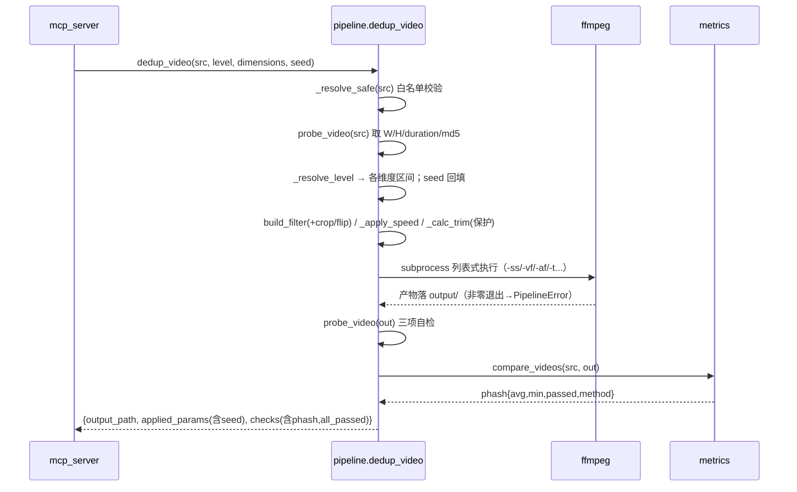
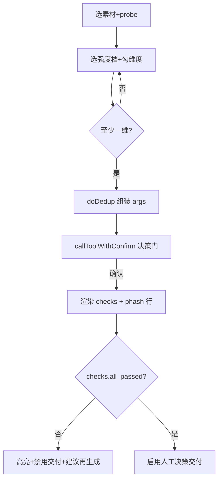

# 02 · 系统详细设计说明书（DD, Detailed Design）

> 视频去重工位 station · 去重维度补齐迭代（第 2 版）
>
> **业务唯一依据**：[../01-需求分析/02-PRD.md](../01-需求分析/02-PRD.md)（PRD）。**架构依据**：[01-SAD](01-系统总体架构设计【SAD（System Architecture Design）】.md)。本 DD 不新增/删除/修改需求。
> **设计范围**：SAD 出全景，DD**聚焦本期 P0 增量**（crop/flip/speed/trim + pHash 自检升级 + rules 分级 + Web UI），既有已上线能力（画面调整/微旋转/去水印/裂变框架）仅在被增量触及处描述。
> **技术栈**：Python 3 标准库 + 原生 JS + ffmpeg（vendor 自包含），本地单用户，无 DB/无远程账户/无 Cookie。
> **粒度**：所有设计可直接映射为「面向 AI 的原子级开发订单」。每模块设计完立即输出 Feature 与 Task Prompt。

---

## 0. 全局约定（贯穿各模块）

### 0.1 强度档 → 各维度参数区间（依据 PRD D-02 / D-03，§6）

| 维度 | 轻 | 中（默认） | 重 | 硬约束 |
|---|---|---|---|---|
| crop 裁剪比例 | 2% | 5% | 8% | >8% 不开放（主体易切+糊化） |
| speed 变速幅度 | ±3% | ±5% | ±10% | 落点须在 atempo 单实例 0.5–2.0 内 |
| trim 头尾各截 | 0.3–0.5s | 0.5–1.0s | 1.0–1.5s | 成片 ≥7s；掐头去尾总量 ≤ 原时长 10% |
| flip 翻转 | —（无强度，仅方向） | 默认关闭 | | 仅无内嵌文字/人脸素材可开 |

> 标「待实测校验」项（Q-02）：crop/trim/flip 百分比为工程推荐值，开发阶段用 `assets/` 真实素材 A/B 校验后固化。DD 以上述值为**基线常量**编码，校验后仅调常量不改结构。

### 0.2 pHash 达标口径（依据 PRD D-01，§8.2/§11）

> ⚠️ **口径已校准（Q-01 实测后变更，2026-08-03 落地，超出 PRD §16.2「constants only」既成事实）**：原 DD 写「`phash_avg ≥ 12` 且 `phash_min ≥ 8`」，实测发现 `phash_min` 是极值统计量，对抽帧数 n 单调不增（同素材 n=8→min=6 / n=32→min=2 / n=48→min=4），200 次重抽样 n=16 时 min 跨度达 6，不可作门。**改为 `phash_avg ≥ 12` 且 `weak_frame_ratio ≤ 0.10`**（弱帧 = 单帧距离 < 8，弱帧占比 = 弱帧数 / 比对帧数；占比是比例估计量，跨 n=8/12/16/24 稳定在 0.103–0.106）。`phash_min` 保留输出**仅作展示，不参与 passed 判定**。归因与错题本见 [../eval/沉淀失败原因.md#historical_lessons](../eval/沉淀失败原因.md)。

- **达标 = `phash_avg ≥ PHASH_AVG_MIN(=12)` 且 `weak_frame_ratio ≤ WEAK_FRAME_MAX_RATIO(=0.10)`**（逐帧 64 位 pHash 汉明距离平均 + 弱帧占比门）。
- `phash_min` 保留输出，仅展示，不参与 passed 判定（`threshold.min_min_enforced=false`）。
- 反向用阈值（判「足够不同」）：距离越大越好；弱帧越少越好。

### 0.3 最短时长保护（依据 PRD §6/§12）

实测落地拆为**两个独立常量**，语义不可混淆：

- **`MIN_DURATION_TRIM = 7.0`**：**trim 跳过闸**。原时长 <7s 时 `_calc_trim` 直接 `skipped=True` 不裁（属「素材天生不适合去头尾」，非裁剪越界，**不抛错**）；裁后 <7s 时把总裁剪量收到成片恰好 7s。
- **`MIN_DURATION_HARD = 5.0`**：**成片硬下限事后校验**。dedup_video 产出后 `checks.min_duration_ok` 校验；原素材本身 ≥5s 时成片必须 ≥5s，原素材天生 <5s 则不要求（素材问题非管线越界）。变速由 `_clamp_speed_for_floor` 在事前钳制 factor 上限，避免加速后跌破 5s。
- **掐头去尾总量 ≤ 原时长 × `MAX_TRIM_RATIO(=0.10)`**：超则按比例钳制到 10% 上限，不抛错。

### 0.4 安全基线（对齐 SAD §10.3，DD 落到字段级）

- **命令注入**：所有 ffmpeg 调用走 `subprocess` **列表式传参**，禁止 shell 字符串拼接。
- **路径穿越**：所有 `src`/`name` 经 `_resolve_safe()` 规范化 + 白名单前缀校验（`assets/` 读、`output/` 写），越界 → `PipelineError`；Hook 层同做前置校验。
- **XSS**：前端所有动态文本走 `escapeHtml`/`textContent`，禁止 `innerHTML` 拼未转义数据。
- **CSRF/本地驱动**：写工具经人工决策门；`delete_output` 硬阻断；Server 增补 `Origin`/`Host` 头校验（§7）。

### 0.5 依赖新增

- Python：`imagehash`（依赖 `Pillow`）。放 `station/requirements.txt`，README 增补安装说明。ffmpeg `signature` 作为无 Pillow 时的降级兜底。

---

## 模块一：感知度量域 `metrics.py`（🆕 新增）

### 1.1 模块职责

独立、无业务耦合的感知哈希度量模块。输入视频路径，抽帧计算逐帧 pHash，输出汉明距离统计与达标判定；支持一组视频两两距离矩阵（裂变用）。**纯函数式，不依赖 pipeline/server，可独立单测**（SAD §2.2 依赖方向）。

### 1.2 功能设计

| 功能 | 说明 |
|---|---|
| 抽帧 | 用 ffmpeg 按时间均匀抽 N 帧（默认 16 帧）到临时目录 PNG |
| 归一化对齐 | 两视频按**时间比例**抽帧（非绝对帧号），使裁剪/变速变体可对齐比对（D-01 要求） |
| 逐帧 pHash | 每帧 64 位 pHash（imagehash.phash），得两序列 |
| 汉明距离 | 对齐帧两两求汉明距离，得 `phash_avg`（平均）、`phash_min`（最小） |
| 达标判定 | `phash_avg ≥ 12 且 weak_frame_ratio ≤ 0.10` → 达标；`phash_min` 仅展示 |
| 距离矩阵 | 一组视频两两计算，返回矩阵 + 是否存在过近对 |
| 降级兜底 | 无 Pillow/imagehash 时走 ffmpeg `signature`，返回 pass/fail 二值（不给数值） |

### 1.3 数据设计

**单对度量结果 `PhashResult`**（与 `metrics._result` 实际返回对齐，Q-01 校准后字段结构）
```
{
  "phash_avg": float,                # 逐帧汉明距离平均（参与判定）
  "phash_min": int,                  # 逐帧汉明距离最小（仅展示，不参与判定）
  "weak_frame_ratio": float | None,  # 弱帧占比 = 弱帧数/比对帧数（参与判定）；signature 兜底时为 None（不适用）
  "weak_frame_count": int | None,    # 弱帧数（< WEAK_FRAME_DIST 的帧数）；signature 兜底时为 None
  "frames_compared": int,            # 实际对齐比对的帧数
  "passed": bool,                    # phash_avg>=12 且 weak_frame_ratio<=0.10（signature 路径由签名匹配直接给）
  "method": "phash" | "signature",   # 实际使用的度量方法
  "threshold": {
     "avg_min": 12,
     "weak_frame_dist": 8,
     "weak_frame_max_ratio": 0.10,
     "min_min": 8,                   # 仅展示，不参与判定
     "min_min_enforced": false,      # 显式标注 min 不参与判定
     "applied": false                # signature 路径独有：不套数值门，passed 由签名匹配直接给
  }
}
```

**距离矩阵结果 `MatrixResult`**（与 `metrics.distance_matrix` 实际返回对齐）
```
{
  "count": int,
  "matrix": [[null|float,...],...],  # 对角线为 null，[i][j]=变体i与j的 phash_avg
  "min_pair": {"i": int, "j": int, "phash_avg": float, "phash_min": int,
               "weak_frame_ratio": float|None, "passed": bool},
  "all_pass": bool,                   # 所有对 passed=true 且 count>=2（口径复用 compare_videos，避免二次漂移）
  "too_close_pairs": [{"i":int,"j":int,"phash_avg":float,"phash_min":int,
                       "weak_frame_ratio":float|None,"passed":bool}]
}
```
> pair 增带 `weak_frame_ratio`/`passed`：新口径下「过近」可能因均值不足、也可能因弱帧过多（如 avg=12.25 但弱帧 31% 仍被拒），只报 avg 会让人看不出被拒原因。

### 1.4 类/函数设计

| 名称 | 签名 | 职责 |
|---|---|---|
| 常量 | `PHASH_AVG_MIN=12`, `WEAK_FRAME_DIST=8`, `WEAK_FRAME_MAX_RATIO=0.10`, `PHASH_MIN_MIN=8`(仅展示), `SAMPLE_FRAMES=16` | 达标阈值与抽帧数。⚠️ `PHASH_MIN_MIN` 已退出判定（Q-01 实测，见 §0.2），仅保留兼容口径 |
| `_extract_frames` | `(video_path, n=16, tmpdir) -> List[Path]` | ffmpeg 按时间比例均匀抽 n 帧为 PNG；列表式传参 |
| `_phash_sequence` | `(frame_paths) -> List[imagehash.ImageHash]` | 逐帧 pHash |
| `_result` | `(phash_avg, phash_min, frames_compared, method, dists=None) -> PhashResult` | 组装结果。`dists` 给齐时算 `weak_frame_ratio=弱帧数/len(dists)`；缺省时退化为 `phash_min>=WEAK_FRAME_DIST ? 0.0 : 1.0`（signature 等无逐帧数据路径用 None） |
| `compare_videos` | `(video_a, video_b, n=16) -> PhashResult` | 两视频对齐抽帧→逐帧汉明距离→统计→达标；无 backend 时自动转 `_signature_fallback` |
| `distance_matrix` | `(video_paths, n=16) -> MatrixResult` | 两两 compare，聚合矩阵与过近对；`all_pass` 复用 `compare_videos.passed`，不二次复算阈值 |
| `_signature_fallback` | `(video_a, video_b) -> PhashResult` | 无 imagehash 时 ffmpeg signature 兜底（`method="signature"`，`passed` 由签名匹配反用给出，`weak_frame_ratio=None` 表不适用，数值字段给占位 0 保持同构） |
| `has_phash_backend` | `() -> bool` | 探测 imagehash + Pillow 是否可用，决定主/兜底路径 |

### 1.5 核心算法：时间比例归一化抽帧对齐

```
输入 video_a(时长 Da), video_b(时长 Db), n=16
对 k in [0..n-1]:
    ratio = (k + 0.5) / n              # 均匀时间比例，取帧中点避免首尾黑帧
    ta = ratio * Da ; tb = ratio * Db  # 各自按自身时长换算时间戳
    抽 a 在 ta、b 在 tb 的帧
逐帧: dist_k = hamming(phash(frame_a_k), phash(frame_b_k))
phash_avg = mean(dist_k) ; phash_min = min(dist_k)
```
> 归一化保证：即便 b 是 a 的裁剪/变速变体（时长/构图变了），仍按「同一相对时刻」比对，度量的是内容差异而非时序错位。

### 1.6 异常处理

| 异常 | 处理 |
|---|---|
| ffmpeg 抽帧失败 | 抛 `PipelineError`，附 ffmpeg stderr 尾部 |
| imagehash/Pillow 缺失 | `has_phash_backend()=False` → 自动走 `_signature_fallback`：`method="signature"`，`passed` 由签名匹配反用给出，`weak_frame_ratio=None`/`weak_frame_count=None`（表「不适用」，非 0），数值字段给占位 0 保持与主路径同构（消费方无需分支判断字段是否存在） |
| 帧数不足（极短视频） | 按实际可抽帧数降 n，`frames_compared` 反映真实值；<2 帧则 `passed=false`（走 `_result(0.0, 0, m, "phash")` 默认 `weak_frame_ratio=1.0`，不抛错交由上层展示） |
| 临时帧清理 | `finally` 删临时目录，失败不影响结果返回 |

### 1.7 Feature 与 AI 执行订单（模块一）

> **落地状态**：F1.1 / F1.2 已 DONE（112 passed in 27.99s）。下方订单保留「设计当下」原貌；实际落地口径以 §0.2 / §1.3 / §1.4 为准（Q-01 校准后改用 `weak_frame_ratio` 门，`PHASH_MIN_MIN` 退出判定），错题本见 [../eval/沉淀失败原因.md](../eval/沉淀失败原因.md)。

**骨干闭环顺序**：`has_phash_backend` → `_extract_frames` → `_phash_sequence` → `compare_videos` → `distance_matrix` → `_signature_fallback`。（先打通单对度量，再叠矩阵与兜底。）

**Feature 1.1 — 单对感知哈希度量**（边界：给两个视频路径，返回 PhashResult；可独立测）

- **输入**：既有 `pipeline.FFMPEG/FFPROBE` 路径常量、`pipeline.probe_video`（取时长）；两个视频绝对路径。
- **核心逻辑**：实现 `has_phash_backend`、`_extract_frames`（ffmpeg 列表式传参、按 §1.5 时间比例抽 16 帧 PNG 到 `tempfile.mkdtemp()`）、`_phash_sequence`（imagehash.phash）、`compare_videos`（对齐→逐帧 hamming→算 `phash_avg`/`phash_min`→按 `PHASH_AVG_MIN=12`/`PHASH_MIN_MIN=8` 判 `passed`）。极短视频降 n；`finally` 清理临时目录。异常抛 `PipelineError`。
- **预期产出**：新增 `station/server/metrics.py`，导出 `compare_videos`。新增 `station/tests/test_metrics.py`：用 `assets/下班来接我.mp4` 与其自身副本（距离≈0，passed=false）及一个明显不同片段（passed=true）各断言一次。运行 `python -m pytest station/tests/test_metrics.py` 通过。

**Feature 1.2 — 距离矩阵与 signature 兜底**（边界：一组视频→矩阵；无 Pillow→降级）

- **输入**：Feature 1.1 的 `compare_videos`；`has_phash_backend`。
- **核心逻辑**：`distance_matrix(video_paths)` 两两调 `compare_videos`，聚合 `matrix`/`min_pair`/`too_close_pairs`/`all_pass`（口径 §0.2）；`_signature_fallback` 用 ffmpeg `signature` 滤镜对两视频出 pass/fail，`method="signature"`、只填 `passed`；`compare_videos` 在 `has_phash_backend()=False` 时转调兜底。
- **预期产出**：`metrics.py` 增 `distance_matrix`/`_signature_fallback`。`test_metrics.py` 增：3 个变体的矩阵断言（对角 null、对称、`too_close_pairs` 命中）+ 模拟无 backend 时 `method=="signature"`。pytest 通过。

---

## 模块二：视频处理域 `pipeline.py` 增量

### 2.1 模块职责（本期增量部分）

在既有 `build_filter` 滤镜链拼装基础上，新增**构图类（crop/flip）与时序类（speed/trim）**四维度；引入**强度档 → 参数区间**编排；把自检从「仅 MD5/分辨率/时长」升级为**叠加 pHash 距离达标**；裂变叠加两两距离矩阵。既有画面调整/微旋转/去水印保持不变，仅并入新编排开关。

### 2.2 功能设计

| 功能 | 说明 | 归类 |
|---|---|---|
| crop 裁剪 | 按比例中心裁切后 `scale` 回原分辨率，保持分辨率不变 | 构图（视频滤镜链） |
| flip 翻转 | `hflip`/`vflip`/`transpose=1`(90°)，默认关闭 | 构图（视频滤镜链） |
| speed 变速 | `setpts=PTS/factor` + `atempo=factor` 音视频同步，保音调 | 时序（需音视频分别处理） |
| trim 去头尾 | `-ss` 头 + `-t` 计算后时长 裁首尾 | 时序（输入裁剪，非滤镜） |
| 强度档编排 | `level ∈ {light/medium/heavy}` → 各维度区间；`dimensions` 开关；`seed` 控随机 | 编排 |
| 自检升级 | 既有三项 + 调 `metrics.compare_videos` 得 phash 达标 | 自检 |
| 裂变矩阵 | 产出后调 `metrics.distance_matrix` | 自检 |

### 2.3 数据设计

**dedup_video 入参（本期扩展，向后兼容）**
```
{
  "src": str,                          # 必填
  "level": "light"|"medium"|"heavy",   # 可选，默认 medium
  "dimensions": {                      # 可选，维度开关（缺省见下）
     "picture": true,   # 既有画面调整（默认开）
     "rotate": true,    # 既有微旋转（默认开）
     "crop": true,      # 🆕 默认开
     "flip": false,     # 🆕 默认关（高破坏，PRD §6）
     "speed": true,     # 🆕 默认开
     "trim": true       # 🆕 默认开
  },
  "flip_mode": "h"|"v"|"90",           # 仅 flip 开时用，默认 "h"
  "seed": int,                          # 可选，缺省随机并回填
  "out_name": str,                      # 可选
  "params": { ... },                    # 可选，逐维精细覆盖（高级），优先级高于 level
  "trim_phase": float                   # 🆕 F2.4 内部参数，∈[0,1]，裂变专用；client 不暴露（见 §2.5d）
}
```

**dedup_video 出参 `checks`（升级后，与 pipeline.dedup_video 实际返回对齐）**
```
"checks": {
  "md5_changed": bool,        # 既有
  "resolution_kept": bool,    # 既有
  "duration_close": bool,     # 既有；启用 speed/trim 时改「范围口径」（预期 ±3%），否则 |Δ|<1.0s
  "min_duration_ok": bool,    # 🆕 F2.x 加：5s 硬下限事后校验（原素材<5s 时恒 true，素材问题非管线越界）
  "phash": {                  # 🆕（结构同 §1.3 PhashResult）
     "phash_avg": float, "phash_min": int,
     "weak_frame_ratio": float|None, "weak_frame_count": int|None,
     "passed": bool, "method": "phash"|"signature",
     "threshold": {...}
  },
  "all_passed": bool          # 🆕 md5_changed & resolution_kept & duration_close & min_duration_ok & phash.passed
}
```

**applied_params（回填实际用值）**：在既有基础上增 `crop_ratio`/`flip_mode`/`speed_factor`/`trim_head`/`trim_tail`/`seed`/`level`；trim 跳过时增 `trim_skipped=true` + `trim_skip_reason`；裂变场景增 `trim_phase`（四舍五入到 4 位）。

**batch_fission 出参（与 pipeline.batch_fission 实际返回对齐）**
```
{
  "src": str, "count": int,
  "variants": [{index, output_path, md5, applied_params, checks}, ...],
  "all_unique": bool,                  # MD5 维度（既有保留）
  "delivery_ready": bool,              # all_unique && matrix.all_pass（唯一交付门）
  "matrix": MatrixResult,              # metrics.distance_matrix 结果（结构同 §1.3）
  "separation": {                      # 🆕 F2.4 加：分离度诊断，指明卡哪条腿
     "time_leg": "present"|"absent",   # absent = 所有变体 trim 都被 MIN_DURATION_TRIM 跳过
     "flip_spread": bool,              # true = 各变体 flip_mode 不全相同
     "hint": str                       # 仅 all_pass=false 且 flip_spread=false 时给出（PRD 人工决策点，不自动开 flip）
  }
}
```
> **设计依据**（实测，见 [../eval/沉淀失败原因.md#root_cause](../eval/沉淀失败原因.md)）：变体间只有两条有效腿——时间错位（δ≥1s → avg 29）与 flip（→ avg 33）；speed/rotate/crop 的变体间差分实测仅 1.9 / 4.1 / 7.5，全部够不到阈值 12（speed 在归一化抽帧口径下恒等）。故 F2.4 起 trim 头尾配比按 phase 确定性铺开（§2.5d），而非 iid 随机。

### 2.4 类/函数设计（增量）

| 名称 | 签名 | 职责 |
|---|---|---|
| 常量 | `LEVELS = {light/medium/heavy: {crop, speed, trim}}`, `MIN_DURATION_TRIM=7.0`, `MIN_DURATION_HARD=5.0`, `MAX_TRIM_RATIO=0.10`, `ATEMPO_MIN=0.5`, `ATEMPO_MAX=2.0` | §0.1 区间表 + §0.3 时长保护常量 |
| `_resolve_safe` | `(path, base_dir, must_exist=True) -> Path` | 🔒 规范化 + 白名单前缀校验（安全基线 §0.4，F2.1 落地，F3.3 第二道闸） |
| `_resolve_level` | `(level=None, dimensions=None, params=None, seed=None) -> (resolved, seed)` | 档位展开为各维度具体区间（含 `_trim_band`/`_speed_band` 等），`params` 覆盖优先；`level` 非法时回退 medium 并标 `_level_note`；`seed` 缺省回填 `random.randint` |
| `build_filter` | 扩展现签名，接 `resolved` | 追加 crop/flip 滤镜节点（在 eq/rotate 之后、scale 保分辨率） |
| `_apply_speed` | `(factor) -> (setpts_node, atempo_node, clamped_factor)` | 生成 `setpts=PTS/factor`/`atempo=factor` 片段；factor 越界钳制到 `[ATEMPO_MIN, ATEMPO_MAX]`（不抛错，回填 clamped 值） |
| `_clamp_speed_for_floor` | `(factor, base_dur) -> (clamped_factor, note)` | 🆕 F2.3 加：变速因子钳到不会让成片跌破 `MIN_DURATION_HARD=5.0` 的范围（`max_factor = base_dur/MIN_DURATION_HARD`，且 ≥1.0）；原素材已 <5s 时只保证「不再加速」。`note` 为 None 表示未钳制 |
| `_calc_trim` | `(duration, band, seed=None, phase=None) -> dict{ss, out_dur, head, tail, skipped, reason}` | 🆕 F2.4 改签名+返回 dict：算头尾裁剪并套 §0.3 三道保护（总量≤10% / 原时长<7s 跳过 / 裁后<7s 收回）。`phase=None` 走原 iid 随机行为（保留向后兼容）；`phase∈[0,1]` 走确定性铺开（§2.5d）。`skipped=True` 时不抛错，由上层据 `applied_params.trim_skipped` 处理 |
| `dedup_video` | `(src, params=None, out_name=None, seed=None, level=None, dimensions=None, flip_mode=None, trim_phase=None)` | 🆕 增 `trim_phase`（裂变专用，client 不暴露）；编排各维度→拼 ffmpeg→产出→调 `metrics` 升级自检；返回结构含 §2.3 `checks`（含 `min_duration_ok`/`phash`/`all_passed`）与 `applied_params`（含 `trim_skipped`/`trim_phase`） |
| `batch_fission` | `(src, count=5, params=None, level=None, dimensions=None, flip_mode=None)` | 🆕 透传 level/dimensions/flip_mode；每变体 `phase=i/(count-1)` 确定性铺开 trim_head；产出后调 `metrics.distance_matrix`；返回结构含 `separation`（§2.3）。默认 5、上限 20，与 PRD D-04 / rules / Web 一致 |

### 2.5 核心算法/实现方案

**(a) crop 保分辨率（构图）**
```
ratio = LEVELS[level]["crop"]        # 0.02/0.05/0.08
cw = round(W*(1-ratio)) ; ch = round(H*(1-ratio))  # 裁掉边缘
crop=cw:ch:(W-cw)/2:(H-ch)/2, scale=W:H              # 中心裁切后缩放回原分辨率
# 自检 resolution_kept 必须仍为 true
```

**(b) speed 音视频同步变速（时序，保音调）**
```
factor = 1 ± LEVELS[level]["speed"]   # 如 0.95 / 1.05
断言 0.5 <= factor <= 2.0             # atempo 单实例硬约束（越界抛错或钳制）
视频: setpts=PTS/factor  (加入 -vf 链)
音频: -af atempo=factor
预估成片时长 = duration / factor → 套最短时长保护（§0.3），<5s 拒绝/钳制
```

**(c) trim 去头尾（时序）**
```
band = LEVELS[level]["trim"]            # (lo, hi) 单侧裁剪秒数区间
trim = _calc_trim(duration, band, seed=seed, phase=trim_phase)  # 返回 dict
# 内部三道保护（§0.3）：
#   1) total_cut ≤ duration * MAX_TRIM_RATIO(0.10)，超则按比例钳
#   2) duration < MIN_DURATION_TRIM(7.0) → skipped=True，不裁（素材天生短，非越界）
#   3) out_dur < MIN_DURATION_TRIM → 把 total 收回到成片恰好 7s
# trim.skipped=True 时上层不传 -ss/-t（不裁），applied_params 标 trim_skipped + reason
ffmpeg（⚠️ -ss/-t 均在 -i 之前，输入侧选项，必守）:
   ffmpeg -y [-ss head] [-t out_dur] -i src -vf ... -c:v libx264 ...
# ⚠️ 不要写成 `-ss head -i src -t out_dur`（-t 在 -i 之后 = 输出侧选项）：
#    输出侧 -t 是在 setpts 变速【之后】度量的，变速会先把流压短，使 -t 阈值大于
#    实际流长而不发生截断 → 去尾被静默吞掉，applied_params.trim_tail 成假报告。
#    实测复现：15.184s 素材 heavy 档，旧写法 trim_tail 失效，duration_close 假绿。
#    错题本见 ../eval/沉淀失败原因.md#historical_lessons。
# 放到输入侧后 trim 与 speed 正交：读 out_dur 秒源 → 变速压成 out_dur/factor。
```

**(d) 维度编排与 seed + trim_phase 铺开（F2.4 增量）**
```
if seed is None: seed = random.randint(1, 10**9)   # 回填
random.seed(seed)
按 dimensions 开关，仅对开启维度采样区间内随机值
多维随机受同一 seed 控制 → 裂变时不同 seed 保证变体与原素材互异

# ⚠️ 但「不同 seed」不足以保证【变体两两互异】（F2.4 实测证伪）：
#    iid 从同一窄区间采样 → 8s 素材 heavy 档 head 差 ≤0.16s，对应 avg 仅 3.5（远低 12）。
#    故裂变时 batch_fission 给每变体传 trim_phase = i/(count-1)：
#      budget = min(2*hi, duration*MAX_TRIM_RATIO, duration-MIN_DURATION_TRIM)
#      head_i = budget * phase_i    # 端到端撑满 [0,1]，head 跨度 = budget = 最大可达错位
#      tail_i = budget - head_i     # 各变体成片时长恒等（=duration-budget），duration_close 不受影响
#    实测：8s 素材 worst pair 3.5 → 18.5（all_pass=true）。
#    单条 dedup_video 调用 trim_phase 缺省 None = iid 行为，向后兼容。
```

**(e) 自检升级（时长范围口径 + 5s 硬下限）**
```
既有 md5_changed / resolution_kept 不变
duration_close 升级为「范围口径」:
   若启用 speed/trim → 预期时长 = f(原时长, factor, cut)，实测 |Δ| ≤ max(0.5, 预期*0.03) 为 true
   若未启用时序维度 → 沿用 |Δ|<1.0s
min_duration_ok（🆕 5s 硬下限事后校验，§0.3）:
   原素材 ≥ MIN_DURATION_HARD(5.0) → 要求成片 ≥ 5.0
   原素材 < 5.0 → 恒 true（素材问题非管线越界，与 _calc_trim 短素材语义一致）
phash = metrics.compare_videos(src_path, out_path)   # 含 weak_frame_ratio，口径见 §0.2
all_passed = md5_changed & resolution_kept & duration_close & min_duration_ok & phash.passed
```

### 2.6 业务流程（时序，单条去重）



### 2.7 异常处理

| 异常 | 处理 | 用户提示（PRD §12 兜底） |
|---|---|---|
| 路径越界 | `_resolve_safe` 抛 `PipelineError` | 素材/产物须在白名单目录 |
| speed factor 越界 | `_apply_speed` 钳制到 `[ATEMPO_MIN, ATEMPO_MAX]`（不抛错，回填 clamped 值） | 变速超安全区间，已钳制 |
| speed 加速后成片会跌破 5s | `_clamp_speed_for_floor` 事前钳 factor 上限（`base_dur/MIN_DURATION_HARD`，且 ≥1.0） | 已钳制变速幅度，避免成片跌破 5s |
| 原素材 <7s（不适合去头尾） | `_calc_trim` 返 `skipped=True`（不抛错），`applied_params.trim_skipped=true` + `trim_skip_reason` | 原时长过短，跳过去头尾 |
| 掐头去尾总量 >10% | `_calc_trim` 按比例钳到 10% 上限（不抛错） | 已钳制裁剪总量到 10% |
| 裁后 <7s | `_calc_trim` 把总裁剪量收到成片恰好 7s（不抛错） | 已收回裁剪量，保证成片 ≥7s |
| ffmpeg 非零退出 | 抛 `PipelineError`，不落半成品 | 报错原因（stderr 尾部） |
| phash 未达标 | 不抛错，`phash.passed=false` + `all_passed=false` | 变体与原素材过于相似，建议加维度/调参/换 seed |
| 裂变矩阵不达标 | 不抛错，`matrix.all_pass=false` + `separation.hint` 指明卡哪条腿（时间错位/flip） | 变体间过近，hint 给出唯一有效杠杆（如短素材只能靠 flip） |
| resolution 变了 | `resolution_kept=false` | 分辨率未保持 |

### 2.8 Feature 与 AI 执行订单（模块二）

> **落地状态**：F2.1 / F2.2 / F2.3 / F2.4 已 DONE（112 passed in 27.99s）。下方订单保留「设计当下」原貌；实际落地偏差以 §2.3 / §2.4 / §2.5 / §2.7 为准（`_calc_trim` 改 dict 返回、增 `_clamp_speed_for_floor`、`dedup_video` 增 `trim_phase`、`batch_fission` 增 `separation`、-ss/-t 移到 -i 前），错题本见 [../eval/沉淀失败原因.md](../eval/沉淀失败原因.md)。

**骨干闭环顺序**：`_resolve_safe` → `LEVELS`+`_resolve_level` → `build_filter`(crop/flip) → `_apply_speed`/`_calc_trim`(保护) → `dedup_video` 编排+自检升级 → `batch_fission` 矩阵。（先安全与档位，再构图维度，再时序维度，最后自检与裂变。）

**Feature 2.1 — 路径安全与强度档编排**（边界：给 level/dimensions/params 得展开后参数；路径越界被拦；可单测）

- **输入**：既有 `pipeline.py` 的 `VIDEO_DIR`/`OUTPUT_DIR`/`DEFAULTS`/`probe_video`。
- **核心逻辑**：新增 `_resolve_safe(path, base_dir)`：`Path.resolve()` 后校验是否在 `base_dir`（assets 读/output 写）前缀内，越界抛 `PipelineError`。新增 `LEVELS` 常量（§0.1 三档区间）与 `_resolve_level(level, dimensions, params)`：把档位展开为 `{crop_ratio, speed_factor, trim_head, trim_tail, flip_mode, ...}`，`params` 逐维覆盖优先；`dimensions` 缺省 = {picture:T,rotate:T,crop:T,flip:F,speed:T,trim:T}；`seed` 缺省回填 `random.randint`。
- **预期产出**：修改 `station/server/pipeline.py`（新增上述函数/常量，不动既有函数签名对外行为）。新增 `station/tests/test_pipeline_orchestration.py`：断言 `_resolve_safe` 对 `../` 越界抛错；`_resolve_level("light"/"heavy")` 返回区间正确；flip 默认 False。pytest 通过。

**Feature 2.2 — 构图维度 crop/flip**（边界：滤镜链正确、分辨率保持；可单测滤镜串）

- **输入**：Feature 2.1 的 `_resolve_level`；既有 `build_filter`。
- **核心逻辑**：扩展 `build_filter`：crop 开时追加 `crop=cw:ch:(W-cw)/2:(H-ch)/2,scale=W:H`（§2.5a，保分辨率）；flip 开时按 `flip_mode` 追加 `hflip`/`vflip`/`transpose=1`。滤镜顺序：eq→hqdn3d→unsharp→(rotate)→crop→flip。回填 `applied_params.crop_ratio`/`flip_mode`。
- **预期产出**：修改 `pipeline.py` `build_filter`。`test_pipeline_orchestration.py` 增：断言 crop 开时 filter 串含 `crop=` 与 `scale=W:H`；flip=h 含 `hflip`；flip 默认不出现。用 `assets/` 素材跑一次 `dedup_video(dimensions={crop:True,flip:False,speed:False,trim:False})`，断言 `checks.resolution_kept==True`。pytest 通过。

**Feature 2.3 — 时序维度 speed/trim + 最短时长保护**（边界：变速保音调、trim 不越界、成片≥5s；可单测）

- **输入**：Feature 2.1；既有 `dedup_video` 的 ffmpeg 命令构造。
- **核心逻辑**：新增 `_apply_speed(factor)` 返回 `setpts=PTS/factor`（并入 -vf）与 `atempo=factor`（-af），断言 `0.5<=factor<=2.0` 否则钳制；新增 `_calc_trim(duration, level, seed)` 返回 `(ss, out_dur)`，套 §0.3（`total_cut<=duration*0.10` 且 `out_dur>=7`，否则钳到安全下限、仍 `<5s` 则抛 `PipelineError`）。`dedup_video` 装配：`-ss ss -i src ... -t out_dur` + speed 的 vf/af。
- **预期产出**：修改 `pipeline.py`。`test_pipeline_orchestration.py` 增：`_calc_trim` 对 6s 视频 heavy 档应抛错/钳制（成片<7s）；factor=1.10 合法、factor=2.5 被钳到 2.0。用一条 ≥10s 素材跑 `dedup_video(dimensions={speed:True,trim:True,...})`，断言产物可 probe 且 `duration` 在预期范围。pytest 通过。

**Feature 2.4 — 自检升级（接 metrics）与裂变矩阵**（边界：checks 含 phash、裂变出矩阵）

- **输入**：模块一 `metrics.compare_videos`/`distance_matrix`；Feature 2.1–2.3。
- **核心逻辑**：`dedup_video` 产出后调 `metrics.compare_videos(src_path, out_path)`，把结果并入 `checks.phash`；`duration_close` 改范围口径（§2.5e）；计算 `checks.all_passed`。`batch_fission` 每变体不同 seed 产出后，收集所有产物路径调 `metrics.distance_matrix`，并入顶层 `matrix`；保留既有 `all_unique`（MD5）。phash 未达标不抛错，仅置 `passed=false`。
- **预期产出**：修改 `pipeline.py` `dedup_video`/`batch_fission`。`test_pipeline_orchestration.py` 锁定纯函数与默认值语义；`test_pipeline_e2e.py` 用真实素材和 ffmpeg 验证输出及五项 `checks` 契约；`batch_fission(count=5)` 返回含 `matrix.count==5` 与 `too_close_pairs` 字段。pytest 通过。

---

## 模块三：传输治理域 `rules.json` + `mcp_server.py` 增量

### 3.1 模块职责

把新维度纳入既有四级分级/走链/字段校验/auto_fill 体系（规则外化，不改 hook 代码）；`mcp_server.py` 更新 `dedup_video`/`batch_fission` 的 `inputSchema` 以暴露新参数，并在 `_summary` 中带 phash 摘要。**协议本身不变**（新增维度是参数级变化）。

### 3.2 数据设计（rules.json 增量）

- 分级：`dedup_video`/`batch_fission` 仍属 **warned**（无变化）；新增无新工具，故 blocked/audit/pass 不变。
- `chain_rules`：`dedup_video`/`batch_fission` 仍 `requires_prior: ["probe_video"]`（不变）。
- `body_check.dedup_video` 增 tier：当 `dimensions.flip=true` 时 `required:["flip_mode"]`；当 `level` 缺失时由 auto_fill 补 `medium`。
- `body_check.batch_fission`：`count` 上限对齐 D-04 = 20（既有 tier0 `required:["src","count"]` 不变，count 范围校验在 pipeline 兜底）。
- `auto_fill.dedup_video` 增 `level: "medium"`；`auto_fill.batch_fission.count` 由 3 调为 5（对齐 PRD D-04 默认值）。
- `ask_user_guides.dedup_video` 文案增补：提示将按所选维度/强度处理，含 phash 自检。

### 3.3 接口设计（mcp_server 增量）

- `dedup_video.inputSchema.properties` 增 `level`(enum)、`dimensions`(object)、`flip_mode`(enum)、`seed`(integer)，`description` 更新为含构图/时序维度。
- `batch_fission.inputSchema` `count.description` 改「1-20」。
- `_summary("dedup_video")` 增 `phash` 摘要；`_summary("batch_fission")` 增 `matrix.all_pass` 与 `delivery_ready`。
- `_exec_tool` 透传新参数给 `pipeline.dedup_video(...)`（`level/dimensions/flip_mode/seed`）。

> **契约稳定性**：`input_required`/`requestState`/`inputResponses.confirm` 于 params 顶层的既有约定**不变**（PRD §14 US-07、记忆锚点一致）。`requestState` 实际落地为 HMAC 签名的无状态句柄，绑定首次请求的 `name + arguments`；确认重发若省略/篡改句柄或替换参数，Server 拒绝且不执行工具。

### 3.4 权限与安全设计（字段级）

- `delete_output` 维持 **blocked** 硬阻断（PRD US-08）。
- flip 为高破坏维度：分级不变（仍在 warned 的 dedup 内），但通过 `body_check` 要求显式 `flip_mode` + 决策门二次确认，实现「默认关、需人工开」（PRD §6/§13）。⚠️ 实际落地：`common._matches_tier_condition` 只读顶层字段，故 server 透传时镜像 `dimensions.flip → args.flip` 顶层让 tier2 命中（详见 §3.6 F3.x 落地校准）。
- 路径白名单双保险（F3.3 实际落地分层）：
  - **第一道（hook 层）**：`pre_tool_guard._check_path_shape` 做**形态校验**（拒 `/` 开头、`\` 开头、Windows 盘符、`..` 段）；`common.is_path_allowed(path, base_dir)` 提供纯函数。hook 跑在 subprocess 里拿不到 VIDEO_DIR/OUTPUT_DIR 绝对路径，只能校形态。
  - **第二道（pipeline 层）**：`pipeline._resolve_safe(path, base_dir, must_exist=True)` 在 `probe_video`/`remove_watermark`/`dedup_video` 写出/`delete_output` 都改用，做 resolve + `relative_to` **绝对归属校验**，越界抛 `PipelineError`。
  - 越界路径在 hook 层即 deny（形态层）；PreToolUse hook 缺失、异常、非零退出、空/非法输出均 fail-closed。pipeline 第二道闸继续作为纵深防御。
- 本地驱动来源门：HTTP 只接受 `Host=127.0.0.1|localhost|[::1]`，浏览器 `Origin` 仅允许本机 HTTP(S) 或 `file://` 对应的 `null`；其余返回 403，CORS 不使用通配 `*`。

### 3.5 异常处理

| 场景 | 处理 |
|---|---|
| flip 开但缺 flip_mode | body_check tier deny，提示补 flip_mode |
| count 超 20 | pipeline 钳制到 20（既有 `min(count,20)`），审计记录实际值 |
| level 非法值 | pipeline `_resolve_level` 回退 medium 并在 applied_params 标注 |
| 未 probe 直连 | 既有强制走链 deny（不变） |

### 3.6 Feature 与 AI 执行订单（模块三）

> **落地状态**：F3.1 / F3.2 / F3.3 已 DONE（112 passed in 27.99s）。下方订单保留「设计当下」原貌；实际落地偏差以本节末「F3.x 落地校准」为准（flip 校验走 server 镜像而非 pipeline 兜底；F3.3 拆为 hook 形态校验 + pipeline 归属校验双保险两层）。

**骨干闭环顺序**：rules.json 增量 → mcp_server inputSchema/summary/透传 → pre_tool_guard 路径白名单。（先外化规则，再暴露参数，最后补安全校验。）

**Feature 3.1 — rules.json 维度分级与校验**（边界：改配置即生效，无需改 hook 代码）

- **输入**：既有 `station/shared/rules.json`；模块二的入参结构（§2.3）。
- **核心逻辑**：按 §3.2 修改 `rules.json`：`auto_fill.dedup_video` 增 `level:"medium"`、`auto_fill.batch_fission.count` 改 5；`body_check.dedup_video` 增 tier（condition `flip=true` → required `flip_mode`）；`ask_user_guides.dedup_video` 文案更新。**不改任何 hook py 代码**。
- **预期产出**：修改 `station/shared/rules.json`。新增/更新 `station/tests/test_rules.py`：加载 rules，断言 `common.apply_auto_fill("dedup_video",{})` 补出 `level`；`common.check_body("dedup_video",{"src":"x","dimensions":{"flip":True}})` 返回缺 `flip_mode`（需构造 flip 条件字段可读——若 condition 读嵌套字段不支持，则在 pipeline 兜底并在测试注明）。pytest 通过。
- **注意（设计冲突提示）**：现有 `common._matches_tier_condition` 读的是 `body.get(field)` 顶层字段，**不支持 `dimensions.flip` 嵌套**。为不改 hook 代码，约定 flip 校验采用**顶层镜像字段** `flip`（server 透传时同时在顶层放 `flip: dimensions.flip`），或在 pipeline `_resolve_level` 兜底校验。DD 采用后者（pipeline 兜底）为主、rules 文案提示为辅，避免动 common 求值器。

**Feature 3.2 — mcp_server 暴露新参数与摘要**（边界：tools/list 显示新参数、透传、summary 带 phash）

- **输入**：Feature 3.1；模块二 `pipeline.dedup_video` 新签名。
- **核心逻辑**：修改 `mcp_server.py`：`dedup_video`/`batch_fission` 的 `inputSchema` 增 `level`/`dimensions`/`flip_mode`/`seed`，`count.description` 改「1-20」；`_exec_tool` 透传新参数；`_summary` 增 phash / matrix 摘要。协议方法与决策门逻辑不动。
- **预期产出**：修改 `station/server/mcp_server.py`。手动/脚本验证：`tools/list` 返回的 dedup_video schema 含新字段；`tools/call dedup_video`（带 confirm）返回 content 内 `checks.phash` 存在。在 `station/tests/test_server_smoke.py`（新增，起 server 于随机端口或直接调 `handle_rpc`）断言上述。pytest 通过。

**Feature 3.3 — Hook 路径白名单双保险**（边界：越界路径在 hook 层即 deny）

- **输入**：既有 `hooks/pre_tool_guard.py`/`common.py`；`pipeline._resolve_safe` 白名单逻辑。
- **核心逻辑**：在 `common.py` 增 `is_path_allowed(tool_name, body, rules)`（对 `src`/`name` 做规范化 + assets/output 前缀校验），`pre_tool_guard.guard` 在字段校验后、warned 分支前调用，越界返回 `continue:false, deny`。白名单基址从 `pipeline` 常量或 rules 配置读。
- **预期产出**：修改 `hooks/common.py`+`hooks/pre_tool_guard.py`。`test_rules.py` 增：构造 `src="../../etc/x"` 断言 `guard` 返回 deny；正常 `assets/` 内文件放行。pytest 通过。

**F3.x 落地校准**（实际实现与上述订单的偏差，2026-08-04 落地）

- **F3.1 flip 校验路径变更**：原订单写「DD 采用 pipeline 兜底为主」。实测发现 `pipeline.build_filter` 静默默认 `flip_mode='h'`（既不抛错也不要求显式声明），pipeline 兜底形同虚设。实际落地改为 **server 层镜像方案**：`mcp_server.handle_rpc` 在 `_run_hook` 之前，若 `args.dimensions.flip=true` 则在 `args` 顶层镜像 `args["flip"]=True`，让 rules.json tier2（field=`flip`, value=`true` → required `flip_mode`）能命中（`common._matches_tier_condition` 只读顶层字段，故必须镜像到顶层）。`hooks/common.py` 求值器未改（守住 §3 红线「不改 tier 求值器」）。
- **F3.3 双保险分层变更**：原订单写 `common.is_path_allowed(tool_name, body, rules)` 单点。实际拆为两层：
  - **第一道（hook 层，形态校验）**：`hooks/common.py` 加 `is_path_allowed(path, base_dir) -> (ok, reason)` 纯函数（`Path.resolve` + `relative_to`）；`hooks/pre_tool_guard.py` 加 `_check_path_shape`（拒绝 `/` 开头、`\` 开头、Windows 盘符、`..` 段），`guard()` step 4 之后插 step 4.5 调用。**hook 跑在 subprocess 里拿不到 VIDEO_DIR/OUTPUT_DIR 绝对路径，只能做形态校验**。
  - **第二道（pipeline 层，归属校验）**：`pipeline._resolve_safe(path, base_dir, must_exist=True)` 在 `probe_video`/`remove_watermark`/`dedup_video` 写出/`delete_output` 都改用，做 resolve + `relative_to` 绝对归属判定，越界抛 `PipelineError`。
  - 第三处 bug 顺手堵：`mcp_server.delete_output` 改用 `_resolve_safe(args['name'], OUTPUT_DIR, must_exist=True)`，原写法 `OUTPUT_DIR / args["name"]` 在 Windows 上实测可让 `target.unlink()` 跨出 OUTPUT_DIR（攻击面被 tier=blocked 拦截，但路径遍历 bug 本身存在）。
  - **运行时安全收口（2026-08-04）**：`_run_hook` 对 PreToolUse 改为 fail-closed（缺失/异常/非零退出/空或非法输出均 deny）；PostToolUse 仅审计，故障只报告，避免反向覆盖已完成业务结果。另补 HMAC `requestState` 请求绑定与 HTTP 本地 `Host/Origin` 校验。

---

## 模块四：工位交互域 Web UI 增量

### 4.1 模块职责

在既有工位壳上暴露**维度勾选 + 强度档选择**，并把去重/裂变结果的 **phash 自检（数值 + 达标）与裂变距离矩阵**渲染出来。既有连接/工具清单/决策模态框/记忆时间线不动。**所有动态文本经 escapeHtml/textContent（XSS 基线 §0.4）**。

### 4.2 功能设计

| 功能 | 说明 |
|---|---|
| 强度档选择 | 单选 light/medium(默认)/heavy，映射到 `dedup_video.level` |
| 维度勾选 | picture/rotate/crop/speed/trim 复选（默认按 §2.3），flip 单独复选（默认关）+ flip_mode 下拉（h/v/90，仅 flip 勾选时启用） |
| 至少一维校验 | 全未勾 → toast 提示至少启用一维（PRD §8.1） |
| phash 展示 | dedup 自检卡新增一行 phash：`avg / min / 达标✓✕ / method`；未达标高亮并显示「建议加维度/换 seed」 |
| 矩阵展示 | 裂变卡新增距离矩阵（表格）+ 过近对高亮 |
| 参数回传 | 调 `callToolWithConfirm("dedup_video",{src,level,dimensions,flip_mode,seed?})` |

### 4.3 接口设计（前端 → 后端）

复用既有 `callToolWithConfirm`。`doDedup` 组装 `args = {src, level, dimensions, flip_mode}`；`doFission` 增 `{src, count, level, dimensions}`。结果结构按 §2.3 消费 `res.data.checks.phash` / `res.data.matrix`。

### 4.4 状态设计（前端）

- 无新增持久状态；档位/勾选为 DOM 即时读取。
- 既有 `localStorage` 记忆时间线（`vds_memory_timeline_v1`）沿用；dedup/fission 记忆摘要增补 phash 达标信息。

### 4.5 业务流程



### 4.6 异常处理

| 场景 | 前端处理 |
|---|---|
| 全未勾维度 | toast「至少启用一个维度」，不发请求 |
| phash method=signature | 展示「兜底度量（无数值）」，只显 passed |
| `checks.all_passed=false` | `确认交付` 禁用并有点击保护，提示当前不可交付 |
| 裂变双门任一失败 | `delivery_ready=false`，使用 warning toast，不得显示交付成功 |
| 后端返回 text（拦截/取消/失败） | 沿用既有 addMemory + toast |
| 恶意文件名渲染 | escapeHtml 转义（禁 innerHTML 拼未转义数据） |

### 4.7 Feature 与 AI 执行订单（模块四）

**骨干闭环顺序**：index.html 增控件 → app.js 读控件组装 args → 渲染 phash 行 → 渲染矩阵。

**Feature 4.1 — 维度/强度档控件与至少一维校验**（边界：UI 能选、组装正确 args）

- **输入**：既有 `station/web/index.html`/`app.js`/`style.css`；§2.3 入参结构。
- **核心逻辑**：`index.html` 在去重区加：强度档单选（light/medium/heavy，默认 medium）、维度复选（picture/rotate/crop/speed/trim + flip）、flip_mode 下拉（仅 flip 勾选时 enable）。`app.js` 新增 `readDimensions()` 读控件返回 `{level, dimensions, flip_mode}`；`doDedup`/`doFission` 用它组装 args；全未勾 → `toast(...,"warn")` 且不发请求。
- **预期产出**：修改 `web/index.html`+`web/app.js`+`web/style.css`。手动验证：勾选后 `doDedup` 发出的 args 含 `level`/`dimensions`；全不勾有提示。（前端无自动化测试框架，交付含一份 `station/web/README-手测清单.md` 勾选项或在 README 增手测步骤。）

**Feature 4.2 — phash 自检与裂变矩阵渲染**（边界：结果结构正确渲染，XSS 安全）

- **输入**：Feature 4.1；§2.3 出参 `checks.phash`/`matrix`。
- **核心逻辑**：`renderDedup` 增 phash 行（avg/min/达标标记/method），未达标加 `fail` 样式 + 建议文案；`renderFission` 增矩阵表格（对角灰、过近对红），读 `d.matrix.too_close_pairs` 高亮。所有值经 `escapeHtml`/`textContent`。`addMemory` 摘要补 phash 达标。
- **预期产出**：修改 `web/app.js`+`web/style.css`。手动验证：跑一次 dedup 看到 phash 行；跑 `batch_fission(count=5)` 看到 5×5 矩阵且过近对高亮。验收步骤固化在 `station/web/README-手测清单.md`。

---

## 模块五：技能编排层 Skills 增量

### 5.1 模块职责

更新 `dedup-video`/`batch-fission` 两个 SKILL.md 的 Mermaid SOP 与失败诊断分支，纳入新维度与 phash 自检；`README.md` 索引表更新。**编排知识（非运行时代码）**，指导 Agent「怎么正确操作」。

### 5.2 功能设计（SOP 增量）

| SKILL | 增量 |
|---|---|
| dedup-video | frontmatter tools 不变；正文步骤增「选强度档/维度」；SOP 流程图自检节点由三项扩为四项（增 phash）；失败诊断增 `phash 未达标` 分支（→ 加维度/换 seed/调档） |
| batch-fission | SOP 增「距离矩阵校验」节点；失败诊断增 `存在过近对` 分支（→ 增维/换 seed 重跑该对） |
| README | 索引表「核心走链」列更新，反映 phash 自检 |

### 5.3 数据/接口/异常

- 无运行时数据；SKILL 为 Markdown。约定：诊断分支必须回指重试节点形成闭环（对齐 README「失败回退」要求）。
- 异常语义与 PRD §12 Badcase 一一对应（phash 过近、时长过短、同质对）。

### 5.4 Feature 与 AI 执行订单（模块五）

**骨干闭环顺序**：dedup-video SOP → batch-fission SOP → README 索引。

**Feature 5.1 — dedup/fission SKILL 补维度与 phash 诊断**（边界：SOP 图含新自检与回退闭环）

- **输入**：既有 `station/shared/skills/dedup-video/SKILL.md`、`batch-fission/SKILL.md`、`README.md`；PRD §12 Badcase 口径。
- **核心逻辑**：dedup-video SKILL：步骤详解增「选强度档/勾维度」；Mermaid 自检判断节点按 `phash_avg<12 或 weak_frame_ratio>0.10` → 诊断「加维度/换 seed/升档」→ 回 dedup 节点；`phash_min` 仅展示；`可调 params` 段补 level/dimensions/flip_mode/seed。batch-fission SKILL：SOP 增矩阵校验节点 + 过近对回退。README 索引表更新走链描述。
- **预期产出**：修改上述 3 个 Markdown。人工核对：两张 Mermaid 图均含 phash 分支且失败回指重试节点（闭环无断头）。无自动化测试。

---

## 附录 A：本期交付物清单（物理路径）

> 落地状态截至 2026-08-04（112 passed in 27.99s）。✅ = 已落地；浏览器步骤 5–7 已有实现侧报告，独立 QA 签字仍待补，不计入独立验收通过。

| 类型 | 路径 | 动作 | 状态 |
|---|---|---|---|
| 新增 | `station/server/metrics.py` | 感知度量域（含 `_result` 带 `weak_frame_ratio`，Q-01 校准） | ✅ F1.1/F1.2 |
| 修改 | `station/server/pipeline.py` | 4 维度 + 编排 + 自检升级 + 路径安全 + `_calc_trim` phase + `_clamp_speed_for_floor` + 裂变 `delivery_ready` 双门 | ✅ F2.1–F2.4 |
| 修改 | `station/server/mcp_server.py` | inputSchema/summary/透传 + flip 镜像 + `delete_output` 白名单 + requestState 绑定 + Pre Hook fail-closed + 本地来源门 | ✅ F3.2/F3.3/运行时安全收口 |
| 修改 | `station/shared/rules.json` | 分级/走链/校验/auto_fill 增量（mtime 2026-08-03 23:34, 5019B） | ✅ F3.1 |
| 修改 | `station/hooks/common.py` `pre_tool_guard.py` | hook 形态校验（`is_path_allowed` + `_check_path_shape`）；pipeline `_resolve_safe` 第二道归属校验 | ✅ F3.3 |
| 修改 | `station/web/index.html` `app.js` `style.css` | 维度/档位 UI + phash/矩阵渲染 + 单条/裂变交付门；裂变默认 5 | ✅ F4.1/F4.2（浏览器步骤 5–7 待独立 QA 签字） |
| 新增 | `station/web/README-手测清单.md` | Web 步骤 1–7、pHash 主/兜底口径、裂变矩阵与独立 QA 签字模板 | ✅ F4 验收资产 |
| 新增/修改 | `station/shared/skills/SKILL.md`、`dedup-video/SKILL.md`、`batch-fission/SKILL.md`、`remove-watermark/SKILL.md`、`README.md` | 目录级契约索引 + SOP + 诊断分支 | ✅ F5.1 |
| 新增 | `station/requirements.txt` | `imagehash`（依赖 Pillow） | ✅ |
| 新增 | `station/tests/test_metrics.py` `test_pipeline_orchestration.py` `test_pipeline_e2e.py` `test_rules.py` `test_server_smoke.py` | 单测 + 真实 ffmpeg 轻量集成测试 | ✅ 五份齐 |
| 修改 | `station/README.md` | 启动、依赖与验收边界 | ✅（独立 QA 报告待补） |

## 附录 B：骨干闭环总顺序（单人开发最快跑通核心业务流）

```
模块一 F1.1 单对度量  →  模块二 F2.1 安全+档位  →  F2.2 crop/flip
  →  F2.3 speed/trim(保护)  →  模块一 F1.2 矩阵/兜底  →  F2.4 自检升级+裂变矩阵
  →  模块三 F3.1 rules  →  F3.2 server 暴露  →  F3.3 hook 白名单
  →  模块四 F4.1 控件  →  F4.2 渲染  →  模块五 F5.1 SKILL
```
> 理由：先打通「度量 + 单条去重升级」这条最短闭环（F1.1→F2.4），即可端到端验证一条素材的新维度去重与 phash 自检；再补治理暴露、前端展示、技能规程。
>
> **进度**：F1.1 → F5.1 及 DD 运行时安全收口已全部落地（112 passed in 27.99s）；实现侧浏览器步骤 5–7 已执行并形成报告，当前仅待独立 QA 成员按 `station/web/README-手测清单.md` 复核或重跑并签字。QA 执行失败不视为测试通过，也不视为实现补充。

## 附录 C：待确认项对设计的影响（承 PRD §16.2，需人工在开发阶段拍板）

| 编号 | 待校验 | 对本 DD 的影响面 | 处理约定 | 实际状态 |
|---|---|---|---|---|
| Q-01 | phash 阈值(12/8)与平台真实判重对齐度 | `metrics.PHASH_AVG_MIN/PHASH_MIN_MIN` 常量、`checks.phash.passed` 口径 | 首轮用 `assets/` 标定后**仅改常量**，结构不动 | ⚠️ **已超出原约定**：实测发现 `phash_min` 是极值统计量随抽帧数漂移不可作门，已改用 `weak_frame_ratio≤0.10` 门并增字段（`weak_frame_ratio`/`weak_frame_count`/`threshold.min_min_enforced` 等），属结构改动（超出 PRD §16.2「constants only」）。既成事实，已在本 DD §0.2/§1.3/§1.4 落地，错题本见 [../eval/沉淀失败原因.md](../eval/沉淀失败原因.md)。后续若需再调口径，须回 PRD 确认 |
| Q-02 | crop/trim/flip 百分比工程推荐值 | `pipeline.LEVELS` 常量 | A/B 校验后**仅改常量表** | 8.0s / 15.2s / 49.5s 工程素材已验证保护、分离度与五项自检，未发现需改常量的代码证据；平台真实判重与观感仍需上线后人工回收，故常量冻结、不宣称平台校准完成 |
| Q-03 | 长/音乐类素材变速漂移 | speed 是否对长视频限档 | 若限档，`_resolve_level` 增时长条件分支（设计已预留位置） | ✅ 客观同步验证已完成：`test_pipeline_e2e.py` 合成 31s 每秒节拍音轨，强制 heavy 1.10x 后 `duration_close=true`，音频/视频流时长差 ≤0.10s；未发现需加长视频限档分支的工程证据。主观听感/平台分发观感仍由人工观察，不作为代码门 |

> 以上均为「常量/局部分支」级可调项，不影响模块边界与接口契约。若校验结果要求**改变达标口径的字段结构或维度语义**，属需求变更，须回 PRD 确认后再改 DD。Q-01 已触发此情形，按此规则落地并标注。
