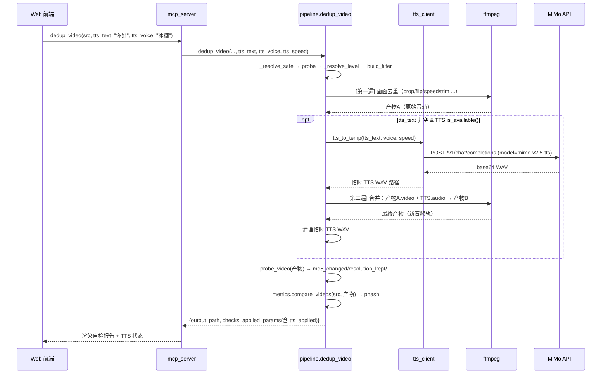

# video-uniqueness\_dd\_p1\_addendum · 云 TTS 音频轨道替换

> **归属**：`video-uniqueness-DD-v1.1.md` 的第 1 份增量补篇
> **触发条件**：新增系统能力（云 TTS 语音合成 + 音频轨替换），属大范围扩展，不直接修改主 DD
> **设计范围**：MiMo TTS v2.5 客户端封装 → ffmpeg 音频轨替换流程 → 前端控件的完整链路
> **业务依据**：PRD 未覆盖此能力；本 Addendum 为探索性增量（2026-08-10 启动）
> **技术栈**：Python 3 + openai SDK（OpenAI 兼容协议）+ ffmpeg + 原生 JS

---

## 1. 模块职责

新增**模块六：云 TTS 域 `tts_client.py`**，作为独立、可降级的语音合成客户端。对接小米 MiMo 平台 `mimo-v2.5-tts` 模型，通过 OpenAI 兼容协议调用。同时扩展现有 `pipeline.py`、`mcp_server.py`、前端 Web UI，实现「文案 → TTS 语音 → 替换视频原始音轨」的完整闭环。

**核心价值**：与现有画面变换维（crop/flip/speed/trim/pHash/SSIM）**正交**——现有维度只动画面，音频轨原封不动；TTS 音频替换补齐平台审核的**音频指纹**维度。

## 2. 功能设计

| 功能 | 说明 |
|---|---|
| 预置音色合成 | 4 个中文音色（冰糖/茉莉/苏打/白桦），可选语速 0.5–2.0× |
| 文案输入 | 前端 textarea 自由输入；留空则不启用 TTS（保持原始音轨） |
| 音频生成 | 非流式调用 MiMo API，输出 24kHz WAV |
| 音频轨替换 | ffmpeg 第二遍合并：视频流=第一遍产物（`-c:v copy`），音频流=TTS WAV（`-c:a aac`），`-shortest` 对齐 |
| 降级策略 | `MIMO_API_KEY` 未设置或 `openai` 未安装时 `is_available()=False`，TTS 功能静默跳过，不影响画面去重 |
| 失败回退 | TTS 生成或合并失败时保留原始音轨，`applied_params.tts_warning` 记录失败原因 |

## 3. 数据设计

### 3.1 tts_client 入参

```python
def tts(text: str, voice: str = "冰糖", speed: float = 1.0, output_format: str = "wav") -> bytes
```

| 参数 | 类型 | 约束 | 说明 |
|---|---|---|---|
| text | str | 1–500 字（建议）；超长文本应分段调用 | TTS 目标文案 |
| voice | str | "冰糖" \| "茉莉" \| "苏打" \| "白桦" | MiMo 预置音色 |
| speed | float | 0.5–2.0，默认 1.0 | 语速倍率（通过 user message 自然语言控制） |
| output_format | str | "wav" \| "pcm16" | 音频输出格式 |

### 3.2 dedup_video 入参（增量字段）

在现有签名基础上增 3 个可选参数：

| 字段 | 类型 | 默认 | 说明 |
|---|---|---|---|
| `tts_text` | str\|None | None | TTS 文案；None=不启用 |
| `tts_voice` | str | "冰糖" | 音色名 |
| `tts_speed` | float | 1.0 | 语速倍率 |

### 3.3 dedup_video 出参 `applied_params`（增量字段）

| 字段 | 类型 | 说明 |
|---|---|---|
| `tts_text` | str\|None | TTS 文案（截断至 100 字供前端展示） |
| `tts_voice` | str\|None | 使用的音色 |
| `tts_speed` | float\|None | 使用的语速 |
| `tts_applied` | bool | TTS 音频替换是否成功 |
| `tts_warning` | str\|None | 失败原因（如有） |

### 3.4 list_voices 出参

```json
{
  "voices": [
    {"id": "冰糖", "lang": "zh", "gender": "女"},
    {"id": "茉莉", "lang": "zh", "gender": "女"},
    {"id": "苏打", "lang": "zh", "gender": "男"},
    {"id": "白桦", "lang": "zh", "gender": "男"}
  ],
  "available": true
}
```

## 4. 类/函数设计

| 名称 | 签名 | 职责 |
|---|---|---|
| `is_available()` | `() -> bool` | 检查 API Key 已设置且 openai 已安装 |
| `list_voices()` | `() -> list[dict]` | 返回可用音色列表供前端渲染 |
| `tts()` | `(text, voice, speed, format) -> bytes` | 核心：调用 MiMo API，返回音频字节 |
| `tts_to_file()` | `(text, output_path, voice, speed) -> Path` | 生成音频并保存到指定路径 |
| `tts_to_temp()` | `(text, voice, speed) -> Path` | 生成到临时文件，调用方负责清理 |

## 5. 核心算法：ffmpeg 音频轨替换流程

```
 素材 ──→ [第一遍 ffmpeg] ──→ 产物A（画面已去重，音频原封）
                                    │
 文案 ──→ [MiMo TTS API]  ──→ 临时 TTS WAV ──┤
                                              │
                            [第二遍 ffmpeg 合并]:
                              -i 产物A  -i TTS.wav
                              -c:v copy        ← 视频流直拷，不重编码
                              -c:a aac -b:a 128k
                              -map 0:v:0       ← 视频取自产物A
                              -map 1:a:0       ← 音频取自 TTS
                              -shortest        ← 时长对齐（取较短的流）
                                    │
                                    ▼
                              最终产物（画面+新音频）
```

**设计约束**：
- 视频流 `-c:v copy`：避免二次编码的画质损失和处理时间
- `-shortest`：当 TTS 音频比视频长时自动截断，比视频短时自动静音补齐（aac 编码器行为）
- 原子替换：`out_path.unlink()` + `merged_temp.rename(out_path)`，避免残留中间文件

## 6. 业务流程（时序）



## 7. 异常处理

| 场景 | 行为 | 用户感知 |
|---|---|---|
| `MIMO_API_KEY` 未设置 | `is_available()=False`，TTS 静默跳过 | 产物保留原始音轨，无提示 |
| `openai` 未安装 | `is_available()=False`，同上 | 同上 |
| MiMo API 调用失败（网络/配额/超时） | 捕获异常，记录 `tts_warning`，保留原始音轨 | 产物正常但音轨未替换；`applied_params` 含警告信息 |
| TTS WAV 为空或格式异常 | ffmpeg 合并失败，记录 `tts_warning` | 回退到原始音轨产物 |
| 第二遍 ffmpeg 失败（磁盘/权限） | 清理中间文件，保留第一遍产物 | 同上 |
| 临时 TTS WAV 残留 | `finally` 块 `unlink(missing_ok=True)` | 无感知 |

## 8. 安全与约束

| 维度 | 措施 |
|---|---|
| API Key 管理 | 仅通过环境变量 `MIMO_API_KEY` 读取，不写入配置文件或 git |
| 文案注入 | 前端 textarea 自由输入，后端透传给 MiMo API；TTS API 不执行任意代码，仅文本→语音 |
| 临时文件 | TTS WAV 写入 `tempfile.mkstemp()`，调用后立即清理 |
| 磁盘占用 | TTS WAV 约 200KB/s（24kHz 16bit mono），单次调用 < 10MB |
| 成本 | MiMo TTS 当前限时免费；后续若收费需在 UI 展示预估成本 |

## 9. 对主 DD 的影响面

| 影响范围 | 程度 | 说明 |
|---|---|---|
| `pipeline.py` `dedup_video` 签名 | 向后兼容 | 新增 3 个可选参数，缺省 None → 不启用 TTS |
| `pipeline.py` `batch_fission` 签名 | 向后兼容 | 同上 |
| `mcp_server.py` 工具清单 | 向前兼容 | 新增 `list_voices`（audit 级），既存工具的 `inputSchema` 增可选字段 |
| `mcp_server.py` `_summary` | 向前兼容 | 新增 `tts_applied`/`tts_voice` 字段，消费方不读不影响 |
| 前端 Web UI | 向前兼容 | 步骤 2 新增 TTS 控件区，不填则不启用 |
| 性能 | 可接受 | TTS API 调用 ~2-5s（文本长度相关）+ ffmpeg 合并 ~2-10s（视频长度相关） |
| 依赖 | 新增 | `openai>=1.0`（`station/requirements.txt` 已更新） |

## 10. Feature 与 AI 执行订单

> **落地状态**：F6.1 已 DONE（2026-08-10，commit `624afef`）。下方订单保留设计原貌。

**骨干闭环顺序**：`tts_client.py` 核心 → `pipeline.py` 集成 → `mcp_server.py` 暴露 → 前端控件。

**Feature 6.1 — TTS 客户端与单条去重音频替换**（边界：文案→WAV→替换音轨→产物自检通过；可独立测）

- **输入**：MiMo API Key（环境变量 `MIMO_API_KEY`）；`pipeline.py` 的 `FFMPEG`/`OUTPUT_DIR`；`dedup_video` 既有流程。
- **核心逻辑**：
  1. 新增 `station/server/tts_client.py`：OpenAI 兼容客户端，封装 `tts(text, voice, speed)` → WAV bytes；`is_available()` 检查 API Key + openai 安装；`list_voices()` 返回音色列表。
  2. `pipeline.dedup_video` 在 ffmpeg 第一遍成功后，若 `tts_text` 非空且 `TTS.is_available()`：调 `tts_to_temp` → 第二遍 ffmpeg 合并（`-c:v copy` + `-map 0:v:0 -map 1:a:0 -shortest`） → 原子替换产物文件。
  3. `applied_params` 回填 `tts_text`（截断 100 字）、`tts_voice`、`tts_speed`、`tts_applied`、`tts_warning`。
  4. `mcp_server.py`：新增 `list_voices` 工具（audit 级）；`dedup_video`/`batch_fission` 透传 TTS 参数；`_summary` 增 TTS 字段。
- **预期产出**：新增 `station/server/tts_client.py`；修改 `pipeline.py` / `mcp_server.py` / `station/requirements.txt`。手动验证：设置 `MIMO_API_KEY` → 启动 server → 上传视频 → 填 TTS 文案 → 去重 → 产物音频轨为 TTS 生成语音。
- **注意事项**：`openai` SDK 为标准依赖，非 MiMo 特有；若用户未申请 MiMo API Key，功能静默降级不阻塞画面去重。

## 附录 A：后续扩展方向

| 方向 | 说明 | 触发条件 |
|---|---|---|
| ASR 自动提取字幕 | 用 MiMo ASR 自动提取原视频对白文本，填入 TTS 文案框 | 用户反馈手动填文案太麻烦 |
| 裂变音频维度 | `batch_fission` 每个变体用不同音色/语速，音频指纹也互异 | 当前裂变交付门通过率低（画面维度用尽） |
| 音色设计与复刻 | 启用 `mimo-v2.5-tts-voicedesign` / `voiceclone` 模型 | 预置音色不够用、有品牌定制配音需求 |
| 长文本分段 | 超 500 字自动分段 → 多次 TTS → ffmpeg concat 拼接 | 有长旁白/解说场景 |
| 音频指纹自检 | 用音频指纹（如 Chromaprint）验证替换后音频轨确实不同 | pHash 只能度量画面，音频轨需要单独校验 |
