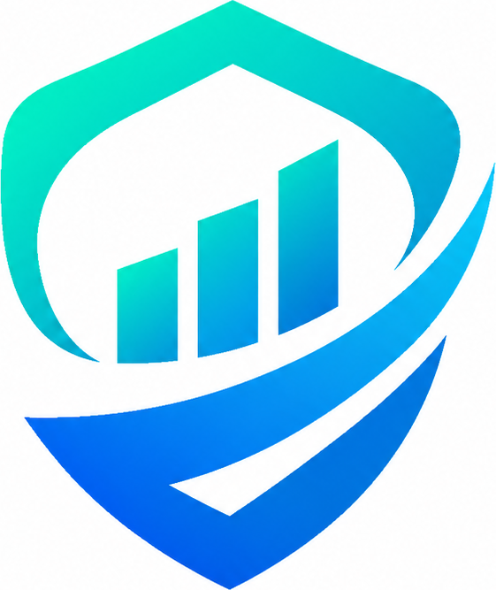
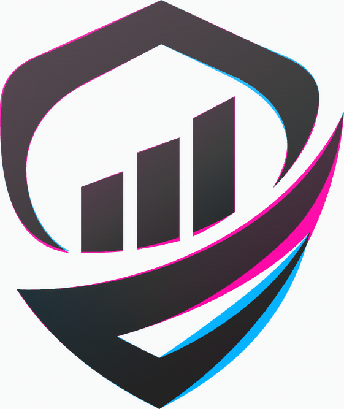
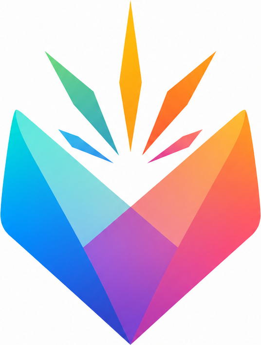
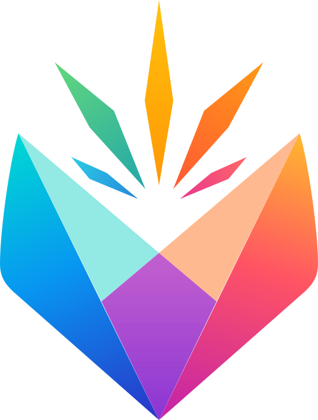
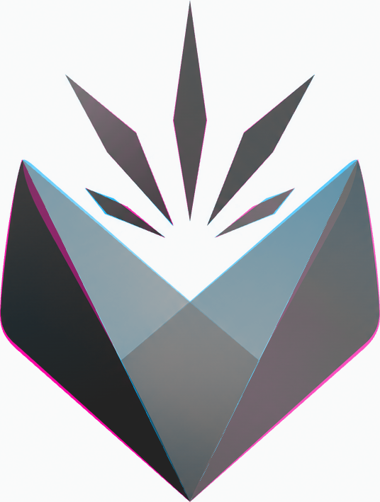

# Image to SVG

[English](README.md) | [简体中文](README.zh-CN.md)

A cross-platform Agent Skill for reconstructing icons, logos, glyphs, and wordmarks from PNG, JPG, WebP, or screenshots as clean, editable SVG files with transparent backgrounds. It follows the open [Agent Skills specification](https://agentskills.io/specification) and can be used by Codex, Claude Code, OpenCode, and other compatible agents.

It treats the supplied raster as the source of truth. The result is real vector geometry—not an SVG wrapper around an embedded bitmap.

## Highlights

- Separates opaque, near-solid, textured, or checkerboard-style backgrounds through automatic analysis or explicit visual evidence before reconstruction.
- Rebuilds flat graphics with paths, primitives, gradients, masks, and reusable geometry.
- Preserves icon-and-wordmark lockups, spacing, alignment, and negative space.
- Converts visible lettering to vector outlines when a stable font dependency is unavailable.
- Audits every SVG for raster embedding and external references.
- Uses Pillow, NumPy, Playwright, and Chrome for enhanced measurement and browser QA when they are already available.
- Still works without optional third-party packages.

## Visual examples

The center column renders the actual editable SVG from this repository; its canvas is transparent. In the difference overlay, cyan marks source-only pixels, magenta marks SVG-only pixels, and dark areas overlap.

### Shield chart

Binary IoU `0.8906` · 5 paths · 34 path commands · [Open the editable SVG](examples/shield-chart/result.svg)

| Original raster | Transparent SVG render | Difference overlay |
| --- | --- | --- |
|  |  |  |

### Prismatic burst

Binary IoU `0.9689` · 10 paths · 29 path commands · [Open the editable SVG](examples/prism-burst/result.svg)

| Original raster | Transparent SVG render | Difference overlay |
| --- | --- | --- |
|  |  |  |

## Best suited for

- App and UI icons
- Logos and brand marks
- Text marks and wordmarks
- Flat illustrations and geometric symbols
- Raster assets with baked white or checkerboard backgrounds

This Skill is not intended for ordinary photo vectorization.

## Platform compatibility

The same repository works across platforms because the portable entrypoint is the root `SKILL.md` file.

| Platform | Personal/global location | Project location |
| --- | --- | --- |
| Codex | `~/.codex/skills/image-to-svg/` or `~/.agents/skills/image-to-svg/` | Use the project Skill location supported by your Codex distribution |
| Claude Code | `~/.claude/skills/image-to-svg/` | `.claude/skills/image-to-svg/` |
| OpenCode | `~/.config/opencode/skills/image-to-svg/` or `~/.agents/skills/image-to-svg/` | `.opencode/skills/image-to-svg/` or `.agents/skills/image-to-svg/` |
| Other compatible agents | Any Skill directory registered by the host | Any project Skill directory registered by the host |

`agents/openai.yaml` only adds optional Codex/OpenAI UI metadata. Claude Code, OpenCode, and other standards-compatible agents can ignore it and use `SKILL.md` directly.

## Installation

Clone the repository into the discovery directory for your agent. Choose one:

```bash
# Codex
git clone https://github.com/zyipeng/image-to-svg.git ~/.codex/skills/image-to-svg

# Claude Code
git clone https://github.com/zyipeng/image-to-svg.git ~/.claude/skills/image-to-svg

# OpenCode native location
git clone https://github.com/zyipeng/image-to-svg.git ~/.config/opencode/skills/image-to-svg

# Portable location supported by OpenCode and compatible agents
git clone https://github.com/zyipeng/image-to-svg.git ~/.agents/skills/image-to-svg
```

Restart the agent or start a new session if it does not support live Skill discovery.

The core workflow requires no additional installation. To inspect optional enhanced QA support:

```bash
cd /path/to/image-to-svg
python3 scripts/doctor.py
```

Only if you explicitly want a standalone local runtime, install the optional dependencies:

```bash
python3 -m pip install -r requirements.txt
npm install
```

## Usage

Attach a raster image and ask your agent, for example:

```text
Use $image-to-svg to turn this logo into a high-fidelity editable SVG with a transparent background.
```

```text
Convert this icon-and-wordmark screenshot to one combined SVG. Preserve the original spacing and remove the baked background.
```

The default deliverable is a transparent, editable `.svg`. When enhanced QA is available, the workflow also produces a browser render, comparison image, and metrics report.

## Quality workflow

1. Inspect transparency, background, bounds, colors, symmetry, and grouping.
2. Separate the intended foreground from the source background.
3. Reconstruct the simplest smooth vector geometry that explains the pixels.
4. Audit the SVG for embedded rasters and external references.
5. Render at the source reference size in a real browser when available.
6. Compare coverage, boundaries, spacing, topology, and color; then refine.

The Skill deliberately avoids applying a universal IoU threshold: a clean primitive with correct topology can be more useful than a noisy automatic trace with a higher score.

## Repository structure

```text
image-to-svg/
├── SKILL.md
├── agents/openai.yaml       # Optional Codex/OpenAI UI metadata
├── examples/                # Source, SVG, and visual comparison examples
├── scripts/
│   ├── analyze_raster.py
│   ├── compare_fit.py
│   ├── doctor.py
│   ├── render_svg.cjs
│   ├── self_test.py
│   └── svg_audit.py
├── references/
│   ├── geometry-recipes.md
│   └── qa-metrics.md
├── requirements.txt
└── package.json
```

## Validation

```bash
python3 scripts/self_test.py
python3 scripts/self_test.py --require-browser
```

The browser-required test automatically searches existing system and configured agent-managed runtimes before considering any new installation. Set `IMAGE_TO_SVG_RUNTIME_ROOTS` when an agent stores reusable runtimes in another location.
