# 批量裂变 SOP

## 适用场景

- 一个素材要生成 `count` 个参数各异的变体，用于多平台/多账号分发铺量，**要求各变体 MD5 互不相同**。
- 单条精细去重请改用 [[dedup-video]]。

## 前置条件

- **强制走链**：调用 `batch_fission` 前**必须**先对同一 `src` 调用 `probe_video`（`chain_rules.batch_fission.requires_prior = ["probe_video"]`），否则被 hook 拦截。
- `batch_fission` 属 **warned（第 3 级）**：会生成多个输出文件并占磁盘，调用先返回 `input_required` 弹窗，需人工确认数量。
- `count` 取值 1–20；缺省由 auto_fill 补为 3。

## SOP 流程图

```mermaid
flowchart TD
    A[开始: 拿到 src] --> B[probe_video&#40;src&#41;]
    B --> C[展示源素材信息]
    C --> D{人工确认变体数量 count?}
    D -->|取消| Z[中止, 不执行]
    D -->|确认| E[batch_fission&#40;src, count&#41;<br/>warned: 弹窗确认]
    E --> F[拿到 job_id 与各变体列表]
    F --> G[get_job&#40;job_id&#41; 查看结果]
    G --> H{all_unique?<br/>各变体 MD5 互不相同}
    H -->|false 有重复| I[诊断: 参数差异不足<br/>增大 count 或加大微调幅度]
    I --> E
    H -->|true 全部唯一| Y[交付 count 个变体]
```

## 步骤详解

| 步骤 | 工具 | 说明 |
|------|------|------|
| 1 探测 | `probe_video{src}` | **必须先做**，确认源素材分辨率/时长/编码。 |
| 2 确认 | —（人工） | 向人展示源信息，确认要生成的变体数量 `count`。 |
| 3 裂变 | `batch_fission{src, count, params?}` | warned 工具：弹窗确认后执行，为每个变体使用不同参数。返回含 `count`、`all_unique`、`job_id`。 |
| 4 查结果 | `get_job{job_id}` | 查任务产出与各变体路径。 |
| 5 校验 | —（读 `all_unique`） | 确认 `all_unique=true`，即各变体 MD5 两两不同。 |

## 失败处理

- **`all_unique=false`**（存在 MD5 相同的变体）：说明变体间参数差异不足。加大每变体的微调幅度或适度调整 `count` 后重试步骤 3。
- 磁盘不足或输出目录写失败：向人报告，勿反复重试占满磁盘。

重试仍不通过时，回退到 [[dedup-video]] 逐条处理，或向人报告源素材特征。
