# 批量裂变 SOP

## 适用场景

- 一个素材要生成 `count` 个参数各异的变体，用于多平台/多账号分发铺量，**要求各变体 MD5 互不相同**。
- 单条精细去重请改用 [[dedup-video]]。

## 前置条件

- **强制走链**：调用 `batch_fission` 前**必须**先对同一 `src` 调用 `probe_video`（`chain_rules.batch_fission.requires_prior = ["probe_video"]`），否则被 hook 拦截。
- `batch_fission` 属 **warned（第 3 级）**：会生成多个输出文件并占磁盘，调用先返回 `input_required` 弹窗，需人工确认数量。
- `count` 取值 1–20；缺省由 auto_fill 补为 5。
- `level` 取 `light`/`medium`/`heavy`，默认 `medium`；`dimensions` 默认启用 `picture`/`rotate`/`crop`/`speed`/`trim`，`flip` 默认关闭。启用 `flip` 时显式传 `flip_mode`（`h`/`v`/`90`）。

## SOP 流程图

```mermaid
flowchart TD
    A[开始: 拿到 src] --> B[probe_video&#40;src&#41;]
    B --> C[展示源素材信息]
    C --> D[选择 count + level + dimensions]
    D --> E{人工确认变体参数?}
    E -->|取消| Z[中止, 不执行]
    E -->|确认| F[batch_fission&#40;src, count, level, dimensions, flip_mode?&#41;<br/>warned: 弹窗确认]
    F --> G[拿到 job_id 与各变体列表]
    G --> H[get_job&#40;job_id&#41; 查任务 handle]
    H --> I[回读本次 batch_fission 返回的 variants / matrix / separation]
    I --> J{all_unique 且 matrix.all_pass?<br/>MD5 + 两两 pHash 距离}
    J -->|all_unique=false| J1[诊断: MD5 重复<br/>增加有效维度或调整强度]
    J -->|matrix.all_pass=false| J2[诊断: 存在过近对<br/>增加 trim/flip 等有效分离维度<br/>或调整 level/params 整批重跑]
    J1 --> F
    J2 --> F
    J -->|全部通过| Y[交付 count 个变体]

```

## 步骤详解

| 步骤 | 工具 | 说明 |
|------|------|------|
| 1 探测 | `probe_video{src}` | **必须先做**，确认源素材分辨率/时长/编码。 |
| 2 确认 | —（人工） | 向人展示源信息，确认要生成的变体数量 `count`。 |
| 3 裂变 | `batch_fission{src, count, level, dimensions, flip_mode?, params?}` | warned 工具：弹窗确认后执行，为每个变体按编排参数生成变体。返回含 `count`、`all_unique`、`matrix`、`separation`、`job_id`。 |
| 4 查任务 | `get_job{job_id}` | 仅查持久化任务 handle；原始 `variants` / `matrix` / `separation` 必须使用第 3 步 `batch_fission` 的本次返回值。 |
| 5 校验 | —（读 `all_unique` / `matrix`） | 同时确认 `all_unique=true` 与 `matrix.all_pass=true`。矩阵对角线为 `null`；`too_close_pairs` 列出未达标的变体对。pHash 对每一对按 `phash_avg >= 12` 且 `weak_frame_ratio <= 0.10` 判定；`phash_min` 仅展示。短素材可能 `separation.time_leg=absent`，需重点看 `separation.hint`。 |

## 失败处理

- **`all_unique=false`**（存在 MD5 相同的变体）：说明输出编码或参数差异不足。增加有效维度、升高 `level` 或适度调整 `count` 后回到步骤 3。
- **`matrix.all_pass=false`**（存在过近对）：读取 `matrix.too_close_pairs` 定位变体对，并结合 `separation` 诊断。优先增加有效时间错位（`trim`，素材需满足最短时长保护）或显式启用 `flip` 并选择不同 `flip_mode`；也可调整 `level`/`dimensions`/`params` 或 `count` 后整批重跑。`batch_fission` 没有公开 `seed` 或“仅重跑某一对”的输入。该分支必须回到步骤 3，不能仅凭 MD5 唯一交付。
- **`separation.time_leg=absent`** 且矩阵未达标：源素材短于 trim 闸值，trim 会被跳过；按 `separation.hint` 采用 flip 等有效分离维度，不要反复只调整无效参数。
- 磁盘不足或输出目录写失败：向人报告，勿反复重试占满磁盘。

重试仍不通过时，回退到 [[dedup-video]] 逐条处理，或向人报告源素材特征与 `too_close_pairs`。
