# 视频去重 SOP

## 适用场景

- 需要把一条已有素材"洗"成平台判定为原创的新视频：改变文件 MD5、微调画面特征，但**保持分辨率与时长基本不变**。
- 单条视频处理。批量生成多个分发变体请改用 [[batch-fission]]。

## 前置条件

- **强制走链**：调用 `dedup_video` 前**必须**先对同一 `src` 调用 `probe_video`。未先探测直接去重会被 pre_tool_guard hook 拦截（`chain_rules.dedup_video.requires_prior = ["probe_video"]`）。
- 已知源文件名或绝对路径（可先 `list_assets` 确认素材存在）。
- `dedup_video` 属 **warned（第 3 级）**：调用会先返回 `input_required` 弹窗，需人工确认参数后才真正执行。

## SOP 流程图

```mermaid
flowchart TD
    A[开始: 拿到 src] --> B[probe_video&#40;src&#41;]
    B --> C[展示分辨率/帧率/编码/时长/MD5]
    C --> D[选择 level + dimensions]
    D --> E{人工确认参数?}
    E -->|取消| Z[中止, 不执行]
    E -->|确认| F[dedup_video&#40;src, level, dimensions, flip_mode?, seed?&#41;<br/>warned: 弹窗二次确认]
    F --> G[拿到 job_id 与 checks]
    G --> H[get_job&#40;job_id&#41; 查任务 handle]
    H --> I[回读本次 dedup_video 返回的 checks]
    I --> J{自检通过?<br/>MD5 / 分辨率 / 时长 / ≥5s / pHash}
    J -->|md5_changed=false| J1[诊断: 微调太弱<br/>加大有效维度或调高 level]
    J -->|resolution_kept=false| J2[诊断: 分辨率被改<br/>检查 crop/scale 参数]
    J -->|duration_close=false 或 min_duration_ok=false| J3[诊断: 时长不满足<br/>关闭 trim/speed 或调整参数]
    J -->|phash.passed=false| J4[诊断: pHash 未达标<br/>加维度 / 换 seed / 升档重试]
    J -->|全部通过| Y[交付输出文件]
    J1 --> F
    J2 --> F
    J3 --> F
    J4 --> F
```

## 步骤详解

| 步骤 | 工具 | 说明 |
|------|------|------|
| 1 探测 | `probe_video{src}` | **必须先做**。读取分辨率/帧率/编码/时长/MD5，作为去重参数基线与后续自检对照。 |
| 2 确认 | —（人工） | 向人展示探测结果，选择 `level`（`light`/`medium`/`heavy`，默认 `medium`）与 `dimensions`（`picture`/`rotate`/`crop`/`speed`/`trim` 默认开，`flip` 默认关）。启用 `flip` 时必须显式选择 `flip_mode`（`h`/`v`/`90`）。这是流程内的人工决策点。 |
| 3 去重 | `dedup_video{src, level, dimensions, flip_mode?, seed?, params?, out_name?}` | warned 工具：先返回 `input_required` 弹窗，人工确认后执行。返回含 `output_path`、`job_id`、`applied_params`、`checks`。 |
| 4 查任务 | `get_job{job_id}` | 用第 3 步返回的 `job_id` 查持久化任务 handle；原始 `checks` 必须使用第 3 步 `dedup_video` 的本次返回值。 |
| 5 自检 | —（读 `checks`） | 检查 `md5_changed` / `resolution_kept` / `duration_close` / `min_duration_ok`，以及 `checks.phash.passed`。pHash 达标口径为 `phash_avg >= 12` 且 `weak_frame_ratio <= 0.10`；`phash_min` 仅展示，不参与判定。 |

**可调 params**：
- 编排：`level`（`light`/`medium`/`heavy`）、`dimensions`（`picture`/`rotate`/`crop`/`speed`/`trim`/`flip`）、`flip_mode`（`h`/`v`/`90`，仅 `flip=true` 时生效）、`seed`。
- 高级覆盖：`brightness`/`contrast`/`saturation`/`rotate_deg`/`fps_range`/`bitrate_mul`/`bitrate_kbps`/`denoise`，以及 crop/speed/trim 的逐维参数。若 `bitrate_mode=fixed` 则必须带 `bitrate_kbps`（body_check tier1）。

## 失败处理

自检任一项为 `false`，按诊断分支调整后回到步骤 3 重试：

- **`md5_changed=false`**（MD5 没变）：微调幅度太弱。启用更多有效维度（优先 `crop`/`trim`，短素材避免 trim），或升高 `level` 后重试。
- **`resolution_kept=false`**（分辨率被改）：本 skill 要求保持分辨率。检查 crop 是否仍按中心裁切后缩放回原尺寸，移除越界参数后重试。
- **`duration_close=false`**（时长偏差大）：检查 `speed`/`trim` 配置；可关闭对应维度或收窄覆盖参数后重试。
- **`min_duration_ok=false`**（成片低于 5 秒）：关闭 `speed` 加速或 `trim`，换用更长素材；原素材低于 5 秒时该检查按素材边界处理。
- **`checks.phash.passed=false`**（pHash 未达标）：确认 `phash_avg >= 12` 且 `weak_frame_ratio <= 0.10`。增加有效维度、切换 `seed`、提高 `level` 后回到步骤 3；`method=signature` 时无数值门，仅依据 `passed` 结果判断。

重试超过 2 次仍不过，应停下向人报告探测数据、所选 `level`/`dimensions`/`seed` 与每次 `checks`，而非继续盲目调参。
