# 视频去重 SOP

## 适用场景

- 需要把一条已有素材"洗"成平台判定为原创的新视频：改变文件 MD5、微调画面特征，但**保持分辨率与时长基本不变**。
- 单条视频处理。批量生成多个分发变体请改用 [[batch-fission]]。

## 前置条件

- **强制走链**：调用 `dedup_video` 前**必须**先对同一 `src` 调用 `probe_video`。未先探测直接去重会被 pre_tool_guard hook 拦截（`chain_rules.dedup_video.requires_prior = ["probe_video"]`）。
- 已知源文件名或绝对路径（可先 `list_assets` 确认素材存在）。
- `dedup_video` 属 **warned（第 3 级）**：调用会先返回 `input_required` 弹窗，需人工确认参数后才真正执行。

## SOP 流程图

```mermaid
flowchart TD
    A[开始: 拿到 src] --> B[probe_video&#40;src&#41;]
    B --> C[展示分辨率/帧率/编码/时长/MD5]
    C --> D{人工确认参数?}
    D -->|取消| Z[中止, 不执行]
    D -->|确认| E[dedup_video&#40;src, params?&#41;<br/>warned: 弹窗二次确认]
    E --> F[拿到 job_id 与 checks]
    F --> G[get_job&#40;job_id&#41; 查看结果]
    G --> H{自检三项}
    H -->|md5_changed=false| I1[诊断: 微调太弱<br/>加大 brightness/contrast/rotate_deg]
    H -->|resolution_kept=false| I2[诊断: 分辨率被改<br/>检查 crop/scale, 移除越界 crop]
    H -->|duration_close=false| I3[诊断: 时长偏差大<br/>检查 fps_range 帧率设置]
    H -->|三项全过| Y[交付输出文件]
    I1 --> E
    I2 --> E
    I3 --> E
```

## 步骤详解

| 步骤 | 工具 | 说明 |
|------|------|------|
| 1 探测 | `probe_video{src}` | **必须先做**。读取分辨率/帧率/编码/时长/MD5，作为去重参数基线与后续自检对照。 |
| 2 确认 | —（人工） | 向人展示探测结果，确认去重参数（默认参数或自定义 `params`）。这是流程内的人工决策点。 |
| 3 去重 | `dedup_video{src, params?, out_name?}` | warned 工具：先返回 `input_required` 弹窗，人工确认后执行。返回含 `output_path`、`job_id`、`checks`。 |
| 4 查结果 | `get_job{job_id}` | 用第 3 步返回的 `job_id` 查任务状态与产出（无状态协议下靠显式 handle 传递）。 |
| 5 自检 | —（读 `checks`） | 检查 `md5_changed` / `resolution_kept` / `duration_close` 三项布尔值。 |

**可调 params**：`brightness`/`contrast`/`saturation`/`rotate_deg`/`fps_range`/`bitrate_mul`/`bitrate_kbps`/`denoise`。若 `bitrate_mode=fixed` 则必须带 `bitrate_kbps`（body_check tier1）。

## 失败处理

自检任一项为 `false`，按诊断分支调参后回到步骤 3 重试：

- **`md5_changed=false`**（MD5 没变）：微调幅度太弱，平台可能仍判为重复。加大 `brightness`/`contrast`/`saturation` 或 `rotate_deg`，再次去重。
- **`resolution_kept=false`**（分辨率被改）：本 skill 要求保持分辨率。检查是否误传了 `crop`/`scale` 参数，移除越界裁剪后重试。
- **`duration_close=false`**（时长偏差大）：多半是 `fps_range` 帧率设置导致抽/补帧过度。收窄帧率区间后重试。

重试超过 2 次仍不过，应停下向人报告探测数据与每次 checks，而非继续盲目调参。
