# 去水印 SOP

## 适用场景

- 素材带有平台固定坐标水印（抖音/腾讯/西瓜等），需按平台模板用 delogo 去除水印区域。

## 前置条件

- 需先知道素材属于哪个平台，以选对模板坐标。
- `remove_watermark` 属 **warned（第 3 级）**：调用先返回 `input_required` 弹窗，需人工确认平台选择正确后执行。
- body_check tier0 要求 `src` 与 `platform` 两个参数必填。

## SOP 流程图

```mermaid
flowchart TD
    A[开始] --> B[list_watermark_templates<br/>查看可用平台模板]
    B --> C[probe_video&#40;src&#41; 探测源]
    C --> D{选定平台 platform?}
    D -->|平台未列出| Z[中止: 无匹配模板<br/>向人报告]
    D -->|已选定| E[remove_watermark&#40;src, platform&#41;<br/>warned: 弹窗确认平台]
    E --> F[拿到输出与 job_id]
    F --> G[get_job&#40;job_id&#41; / 人工验片]
    G --> H{水印区域已清除?}
    H -->|否, 位置不对| I[诊断: 平台选错或模板坐标不符<br/>换 platform 重试]
    I --> E
    H -->|是| Y[交付输出文件]
```

## 步骤详解

| 步骤 | 工具 | 说明 |
|------|------|------|
| 1 列模板 | `list_watermark_templates` | 查看可用平台（抖音/腾讯/西瓜等），确认目标平台在列。 |
| 2 探测 | `probe_video{src}` | 确认源素材分辨率——模板坐标与分辨率相关。 |
| 3 选平台 | —（人工） | 根据素材来源选定 `platform`。 |
| 4 去水印 | `remove_watermark{src, platform, out_name?}` | warned 工具：弹窗确认平台后执行 delogo。 |
| 5 验片 | `get_job{job_id}` / 人工 | 检查水印区域是否已清除。 |

## 失败处理

- **目标平台不在模板列表**：无匹配坐标模板，中止并向人报告，勿盲选其他平台。
- **水印未清除干净或位置不对**：多为 `platform` 选错（模板坐标与实际水印位置不符）。换正确 `platform` 后回到步骤 4 重试。

相关：处理完可接 [[dedup-video]] 进一步去重，或 [[batch-fission]] 批量分发。
